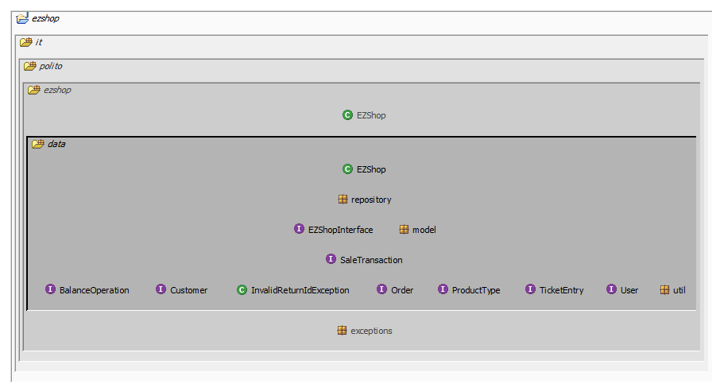
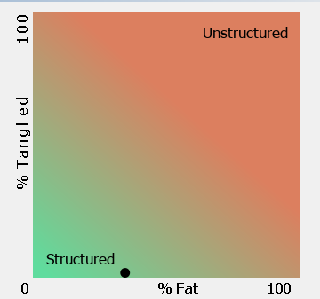
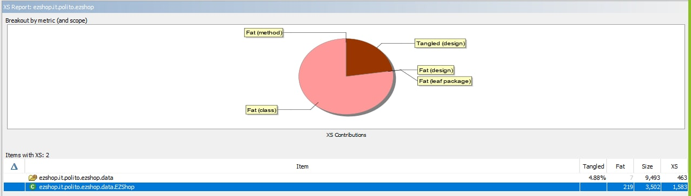
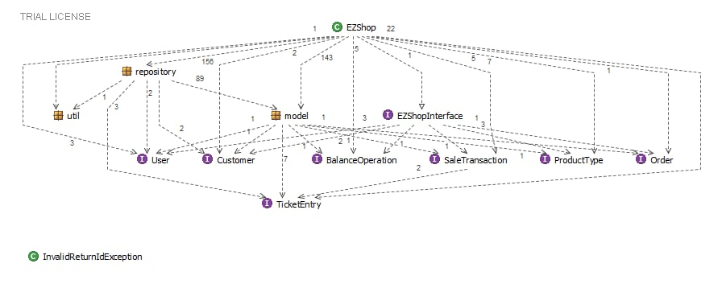

# Design assessment


```
<The goal of this document is to analyse the structure of your project, compare it with the design delivered
on April 30, discuss whether the design could be improved>
```

# Levelized structure map


# Structural over complexity chart


# Size metrics

| Metric                                    | Measure |
| ----------------------------------------- | ------- |
| Packages                                  | 8       |
| Classes (outer)                           | 44      |
| Classes (all)                             | 44      |
| NI (number of bytecode instructions)      | 9703    |
| LOC (non comment non blank lines of code) | 4172    |


# Items with XS

| Item                                | Tangled | Fat  | Size | XS   |
| ----------------------------------- | ------- | ---- | ---- | ---- |
| ezshop.it.polito.ezshop.data.EZShop |         | 219  | 3502 | 1583 |
| ezshop.it.polito.ezshop.data        | 5%      | 7    | 9493 | 463  |


# Package level tangles





# Summary analysis

***Changes from the previous design:***

In the initial design "OrderClass" and "ReturnTransactionClass"  were inherited from the "Debit" class, and "SaleTransactionClass" was inherited from the "Credit" class. Then both "Debit" and "Credit" classes were inherited from "BalanceOperationClass".

In coding, this was not possible since the "OrderClass" couldn't implement the "Order" interface and inherit the "Debit" class at the same time because of the conflict in the return value of the "getBalanceId" method.

***Possible changes to consider regarding fat and tangle:***

**Fat:** ezshop.it.polito.ezshop.data.EZShop class is considered a fat class. The reason is that we implemented all the logic inside this class. (Except working with the database which is done through Repository classes)

**Solution:** Besides from "repository" package we could consider another package called "Service", and create service classes for "User", "Customer", "Product", and "BalanceOperation" separately. 

The logic of each part would be done inside the corresponding class and then Ezshop class (the current fat class) would call the required methods from the "service" package.

**Tangle:** The overall tangle inside structural over-complexity chart is reported 0 %. However, inside "Items with XS tangles (design)" the data package is reported with a 4.88% tangle. This percentage is because of the interfaces which are placed inside the "data" package.

**Solution:** By moving each interface to its package this will be solved. 
