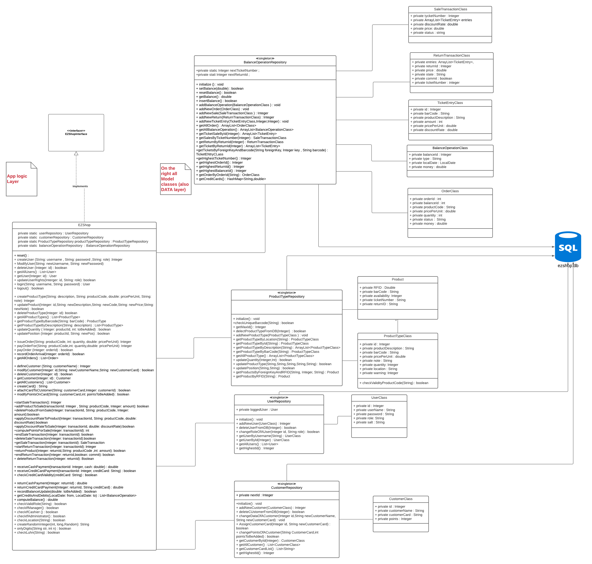

# Design Document

Authors:

Date:

Version:

# Contents

- [High level design](#package-diagram)
- [Low level design](#class-diagram)
- [Verification traceability matrix](#verification-traceability-matrix)
- [Verification sequence diagrams](#verification-sequence-diagrams)

# Instructions

The design must satisfy the Official Requirements document, notably functional and non functional requirements

# High level design

# Low level design

# Verification traceability matrix

# Verification sequence diagrams

- Scenario 1.1 1.2 1.3

- Scenario 2.1

- Scenario 2.2

- Scenario 2.3

- Scenario 3.1

- Scenario 3.2

- Scenario 3.3

- Scenario 4.1

- Scenario 4.2

- Scenario 4.3

- Scenario 4.4

- Scenario 5.1

- Scenario 5.2

- Scenario 6.1

- Scenario 6.2

- Scenario 6.3

- Scenario 6.4

- Scenario 6.5

- Scenario 6.6

- Scenario 7.1

- Scenario 7.2

- Scenario 7.3

- Scenario 7.4

- Scenario 8.1

- Scenario 8.2

- Scenario 9.1

- Scenario 10.1

- Scenario 10.2

