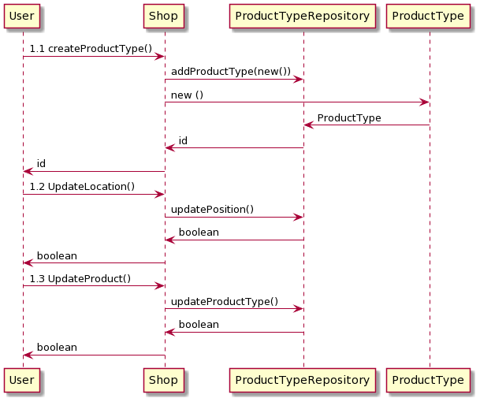

# Design Document

Authors:

Date:

Version:

# Contents

- [High level design](#package-diagram)
- [Low level design](#class-diagram)
- [Verification traceability matrix](#verification-traceability-matrix)
- [Verification sequence diagrams](#verification-sequence-diagrams)

# Instructions

The design must satisfy the Official Requirements document, notably functional and non functional requirements

# High level design

Inside EZshopApplication package we divided logic, data and model

# Low level design

# Verification traceability matrix

# Verification sequence diagrams

- Scenario 1.1 1.2 1.3

- Scenario 2.1 2.2 2.3

- Scenario 3.1 3.2 3.3

- Scenario 4.1 4.2 4.3 4.4

- Scenario 5.1

- Scenario 5.2

- Scenario 6.1 6.2 6.3

- Scenario 6.4 6.5 6.6

- Scenario 7.1 7.2 7.3 7.4

- Scenario 8.1 8.2

