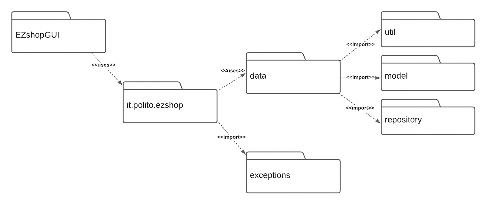

# Design Document

Authors:

Date:

Version:

# Contents

- [High level design](#package-diagram)
- [Low level design](#class-diagram)
- [Verification traceability matrix](#verification-traceability-matrix)
- [Verification sequence diagrams](#verification-sequence-diagrams)

# Instructions

The design must satisfy the Official Requirements document, notably functional and non functional requirements

# High level design

# Low level design

# Verification traceability matrix

\<for each functional requirement from the requirement document, list which classes concur to implement it>

# Verification sequence diagrams

- Scenario 7.1

- Scenario 7.2

- Scenario 7.3

- Scenario 7.4

- Scenario 8.1

- Scenario 8.2

- Scenario 9.1

- Scenario 10.1

- Scenario 10.2

