# Graphical User Interface Prototype

Authors: Setareh Askarifirouzjaei s288485  Ressa Eugenio s281642 Daniel Peña López s286489

Date: 21/04/2021

Version: 1

### Use case 1, UC1

Handle sale transactions between cashier and customer

# Scenario 1.1.1

- To start a purchase, the cashier has just to start scanning products in their main page.  

- Once all the products are scanned, the cashier only will have to enter the amount of money that is going to paid (the cash given if cash of the exact amount purchased if credit card) and click in "Pay" 
- Then the cashier will have to choose the method of payment (credit card or cash) in the next view. 

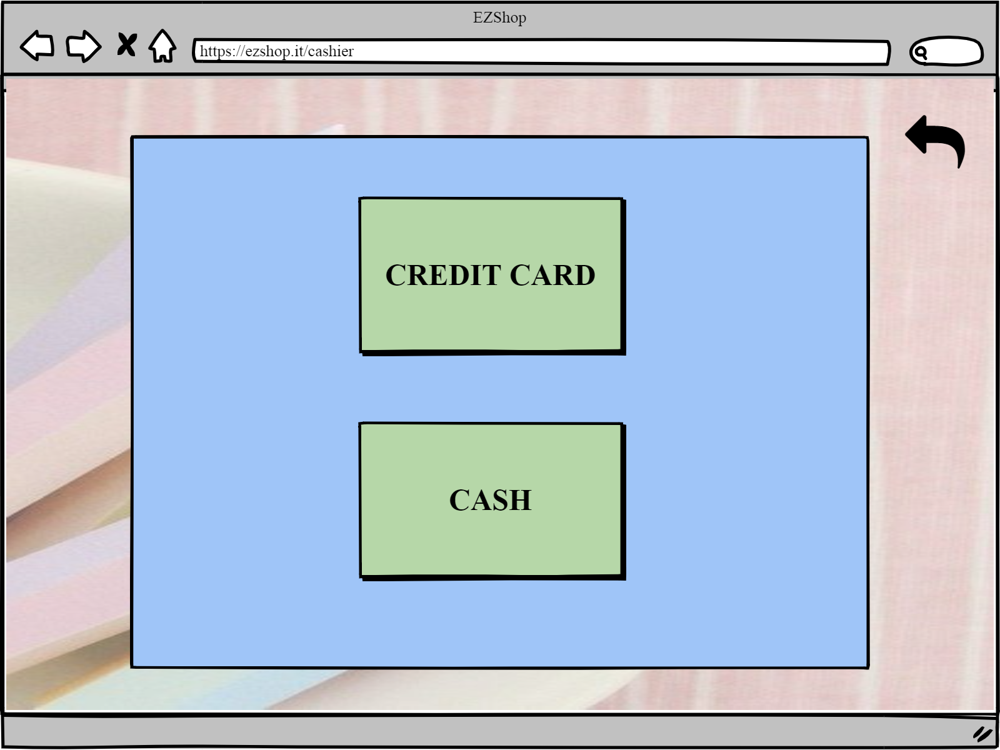

- If the cashier chooses credit card, he/she will be redirected to the next view, where he/she will see the amount of money that will have to enter into the credit card reader.  
- Until the cashier does not click in new purchase, the ticket will not be printed and the transaction will not be registered   
- The cashier can also come back to the on going purchase by clicking in "come back" 

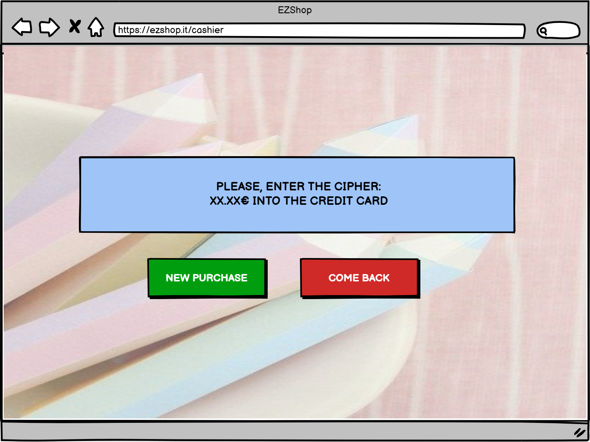

- If the cashier chooses cash, he/she will see the next view where it is possible to see the amount of money the cashier has to give back  
- Like in the previous case, once the button new purchase is clicked, the ticket will be printed and the purchase registered  

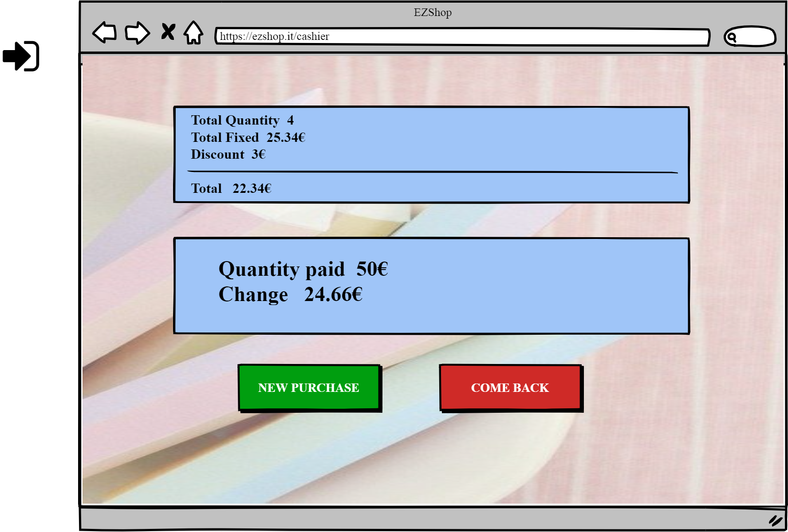

# Scenario 1.1.2

- For performing a purchase with fidelity card, the cashier has an option in their main page: "Fidelity Card". 
- The process is exactly the same as in the last scenario, the cashier only has to click in the "fidelity card" button in any moment during the purchase and ask the customer to scan it or also, the cashier can enter the Number of the card manually in the next view. 
- By clicking in Ok, the cashier can come back to the purchase. 

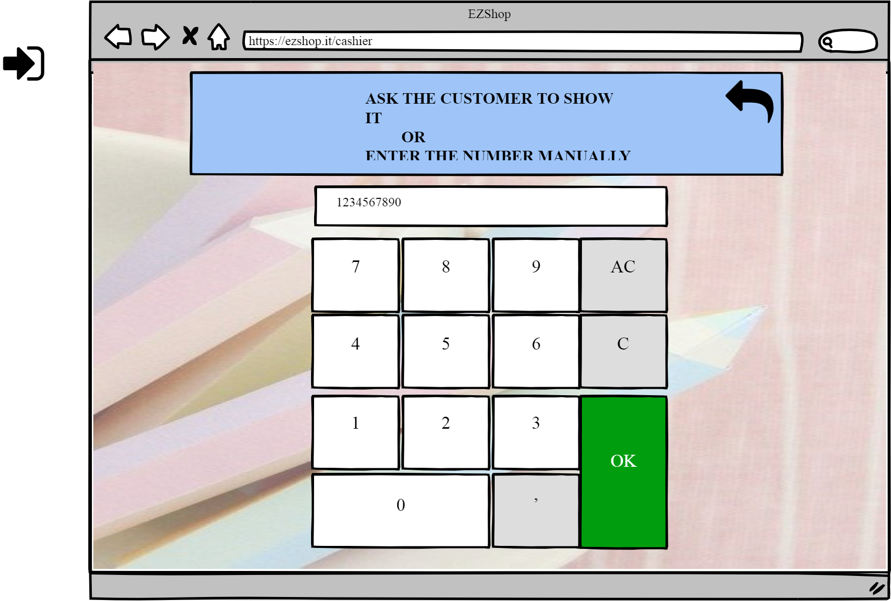

# Scenario 1.2

- In the main page, The cashier has the button "Cancel purchase". This way, he/she can easily abort the transaction in any moment he/she desires. After clicking this button, he/she will be redirected to the main page again. 

# Scenario 1.3

- In the main page, the cashier can click in the little "trash" next to each product in order to delete a specific product from the purchase. 

# Scenario 1.4

- If a product is not readable, the customer can enter manually the number of the product. 
- To access the view that allows you to enter the number, the cashier has to clicked in the plus in their main page . 

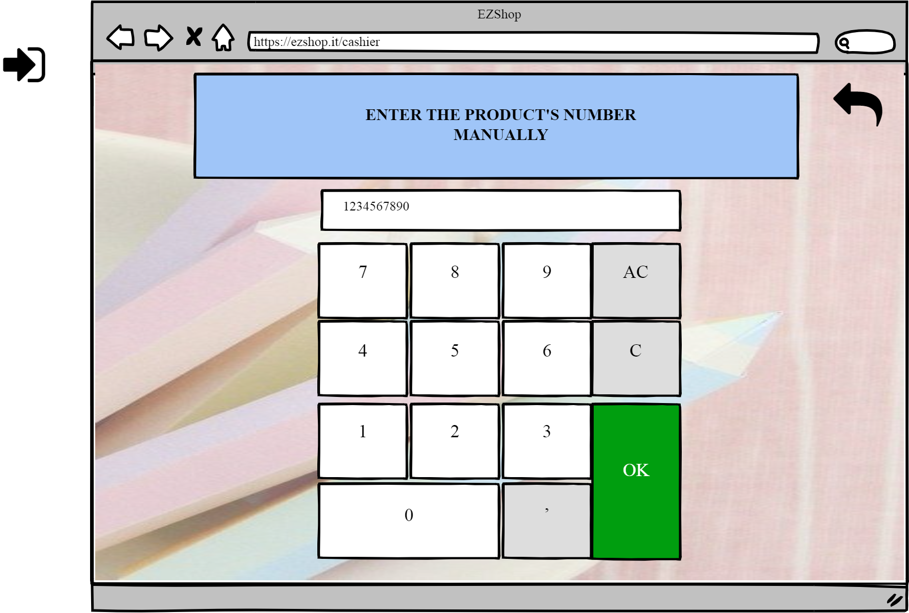

### Use case 2, UC2

Handle sale transaction between supplier  and  stationery shop

# Scenario 2.1

- The clerk is in their main page and clicks in start transaction. 

- The clerk chooses from the transaction list, the transaction (between shop and supplier) that he/she is going to check and registered. 

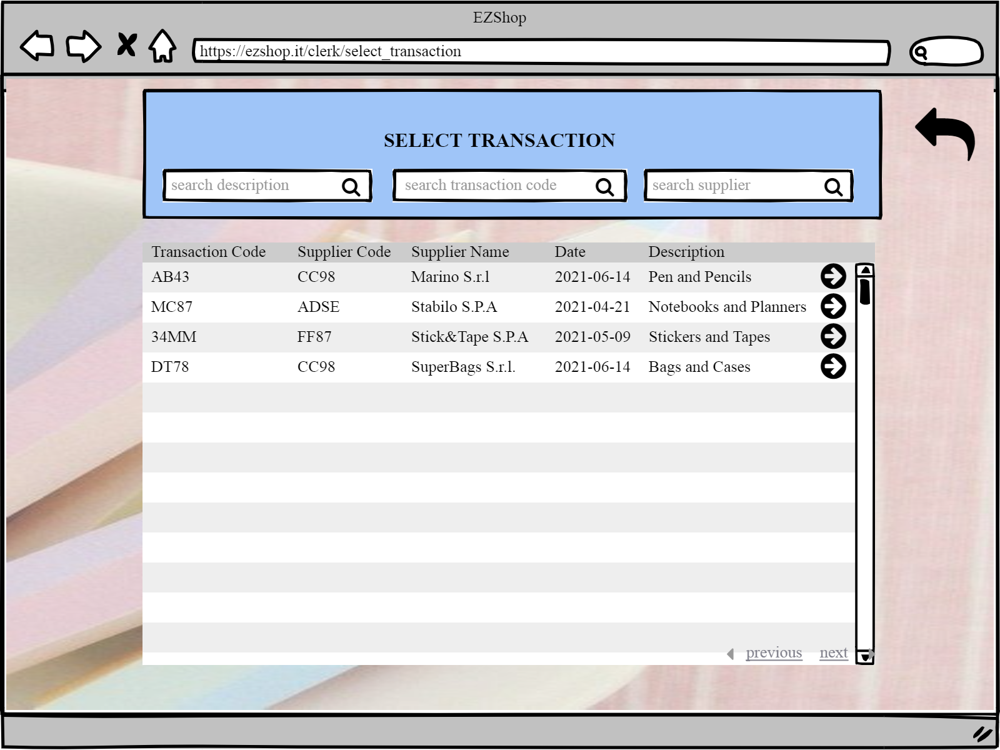

-In the next view, the clerk can add the actual quantity that is in the received package and compare it to the one ordered. 

- When the transaction is finished the clerk can click in submit, a certification will be printed and the clerk will be logget out  

# Scenario 2.2

- The clerk can abort the transaction just by clicking the "Cancel Transaction" button   

 
### Use case 3, UC3

Authorize and authenticate

# Scenario 3.1 and Scenario 3.2.2

- Authentication of manager is a two step authentication
- Authentication of the accountant is by username and password

- The accountant is authenticated after entering username and password  

- The manager is directed to the sencond step of authentication 

- The manager is redirected to: 

- The accountant is redirected to: 

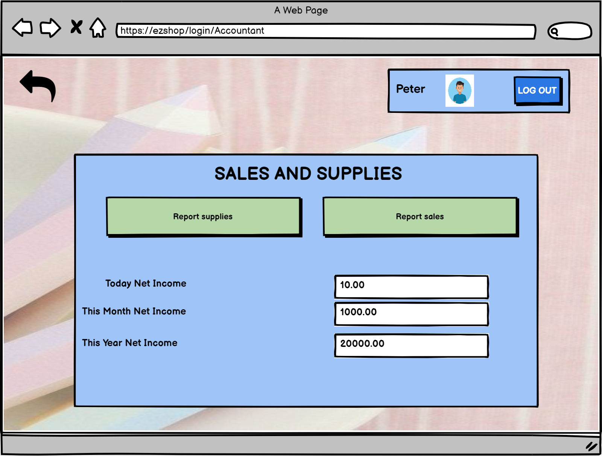

# Scenario 3.2.1

- Authentication of others (except manager)( one way authentication)
- Authentication of cashier and the clerk is by their ID card

 

- Then the clerk is directed to:

 

- And the cashier is directed to:

 

# Scenario 3.2.3

The software doesn’t recognise the code of the ID card

 

 

# Scenario 3.2.4

Accountant/manager forgets the password

 

 

 

 

 

### Use case 4, UC4

Show statistics of the stationery store

# Scenario 4.1

Show statistics of sales (click on report sales) (Manager case)

 

# Scenario 4.2

Show statistics of supplies (click on report supplies) (Manager case)

 

The accountant can also access to these views from their own menu

### Use case 5, UC5

Manage discount for fidelity card

# Scenario 5.1

Adding new discount (click on discount policy)

Manager clicks in add discount 

 

Manager chooses a product from the list

 

Manager inserts manually in the list the discount and the points requested

# Scenario 5.2

Edit discount (Manager clicks in Discount Policy)

 

Manager inserts directly in the table the new discount and points requested

# Scenario 5.3

Change Points Policy (Manager clicks in Discount Policy)

The Manager can change the discount in the Points policy section 

### Use case 6, UC6

Create and edit fidelity cards

# Scenario 6.1

Show the fidelity card lists and their owner (Manager clicks in Fidelity card menu)

 

The manager clicks on see customer profile item

 

# Scenario 6.2

Edit information of fidelity card owner (Manager clicks in Fidelity card menu)

 

The manager clicks on see customer profile item

 

The Manager modifies the fields of the profile and saves.

 

The Manager clicks on the delete icon and deletes a fidelity card

# Scenario 6.3

Create fidelity card (Manager clicks in Fidelity card menu)

The Manager clicks in create a fidelity card 

 

The Manager enters the fields of the profile and save

 

### Use case 7, UC7

Define and edit accounts

# Scenario 7.1

Create a new account

The manager clicks on the green “+” on EMPLOYEES section

 

The Manager fills the form

 

The Manager sets the weekly schedule of the employee

 

# Scenario 7.2

Edit account

The manager clicks on an EMPLOYEE 

Then, the manager can see and edit the fields and schedule of this employee or even delete it 

 

 

# Scenario 7.3

Delete Account

The Manager can just click in the trash that says Delete employee 

### Use case 8, UC8

Location of the products is set by the manager

# Scenario 8.1

Manager creates a map of the shop with the location of the products (by clicking in create new map)

 

The Manager can establish the products that are going to be in each shelf in order to guide the clerk through the recolocation 

 

 

# Scenario 8.2

Manager edits one map (by clicking in edit map)

The Manager just has to click in the pencil that is in the same row as the product that wants to change 

 

 

### Use case 9, UC9

Location of products is shown to clerk

# Scenario 9.1

Display map (by clicking in display map)

The clerk can see the map created by the manager for colocating the data 

 

### Use case 10, UC10

Show, Edit and create organizational information

# Scenario 10.1

Show information of employees

The Manager can click in the photo of one employee

Then, the manager can see the profile of the employee 
Also, the manager can see the information about the schedule by clicking in the button schedule 

# Scenario 10.2 and Scenario 10.3

- Show information of suppliers
- Edit information of suppliers

 

 
- All the information about the suppliers is shown   

**Edit information of suppliers**

- The manager clicks on the supplier editor icon and modify the editable fields. 

- Then clicks on "add product"  

- Then comes back and clicks save 

# Scenario 10.4

Create a new supplier (clicks in edit suppliers)

 

 

The Manager can choose the products that this supplier will supply 

# Scenario 10.5

Show all the trasactions (by clicking in show orders menu)

 
The Manager can see the items of one transaction by clicking in the arrow on the left 

# Scenario 10.6

Create an order from a supplier (by clicking in show orders menu)

Then, the manager can click in create order 

- The manager chooses the supplier , searching it by code and name
- The manager clicks on choose item

 

- The manager modifies only the “input quantity” values of the needed products
- The manager clicks on “ create order”

 

### Use case 11, UC11

Add/modify or delete a product record

# Scenario 11.1

- The manager can see the "Show Glossary option" to see the inventory from the main page below 

- In the inventory page below, the manager can just click in the item record icon to see the details of a certain product record 

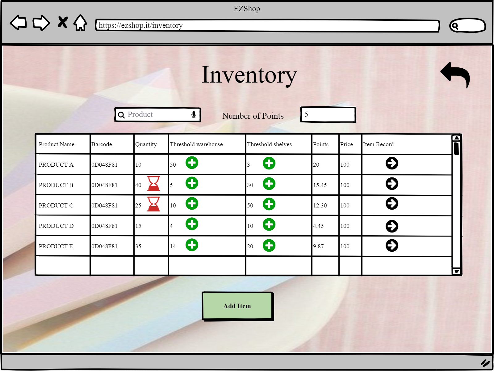

# Scenario 11.2
Modify threshold of the inventory

- The manager can see from the inventory page the threshold of a certain product that will set an alarm. In order to change this threshold, the manager just have to click in the corresponding "+". 

- In the next view, the manager will be able to change the threshold.  

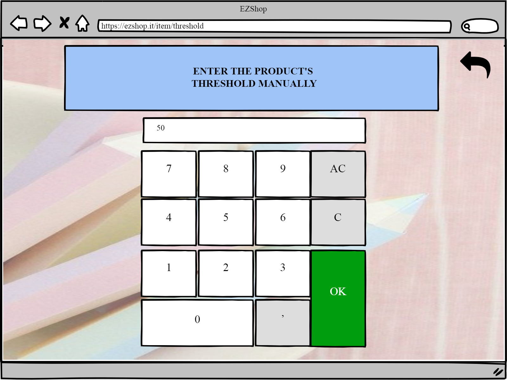

# Scenario 11.3
Add new product to inventory

- To add a new product to the inventory, the manager has just to click in the "Add item" button in the inventory menu. 

- In the next view, the manager will be able to enter the information about the new item and save it.  

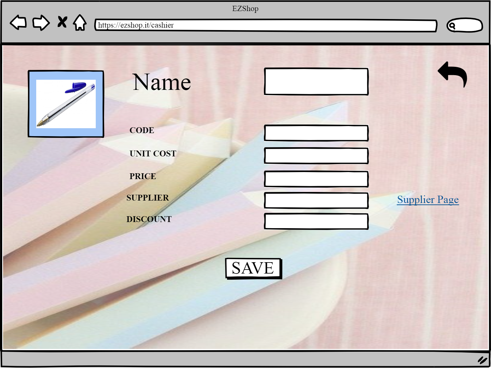

### Use case 12, UC12

Creating an alarm for products reaching their threshold in quantity

# Scenario 12.1 and Scenario 12.2

Soon to be out of stocks product raises an alert through the bell icon to the manager

 
Soon to be out of stock products in the shelf raise an alert through the bell icon to the clerk

 
The products that have reached the threshold are shown

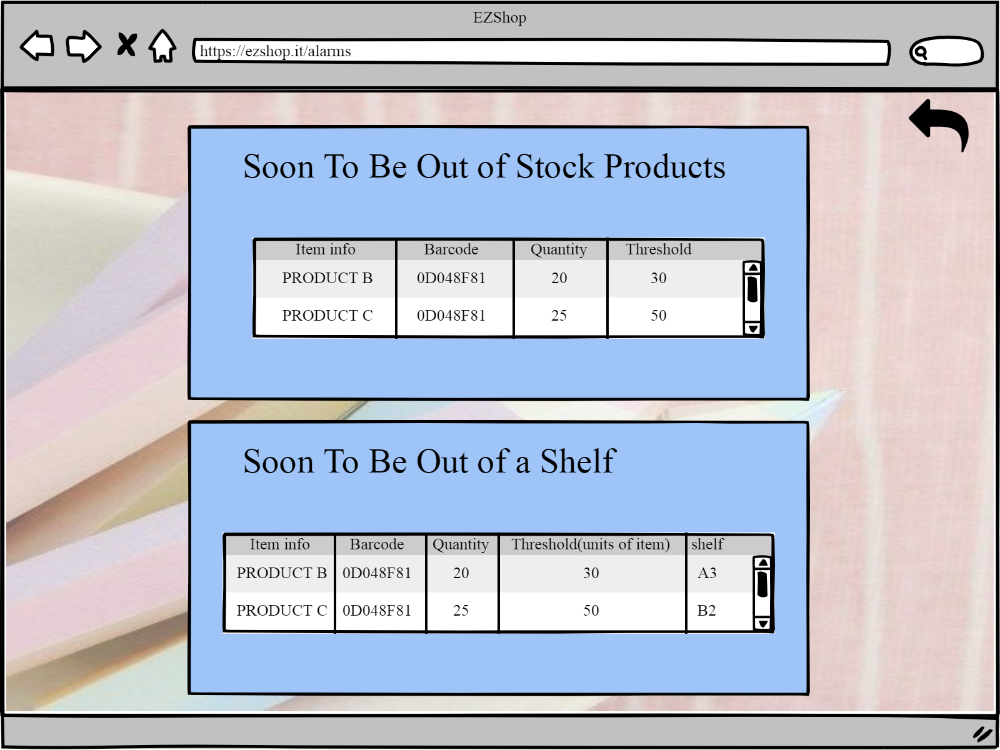

 
