# Graphical User Interface Prototype

Authors:

Date:

Version:

### Use case 3, UC3

Authorize and authenticate

# Scenario 3.1 and Scenario 3.2.2

- Authentication of manager is a two step authentication
- Authentication of the accountant is by username and password

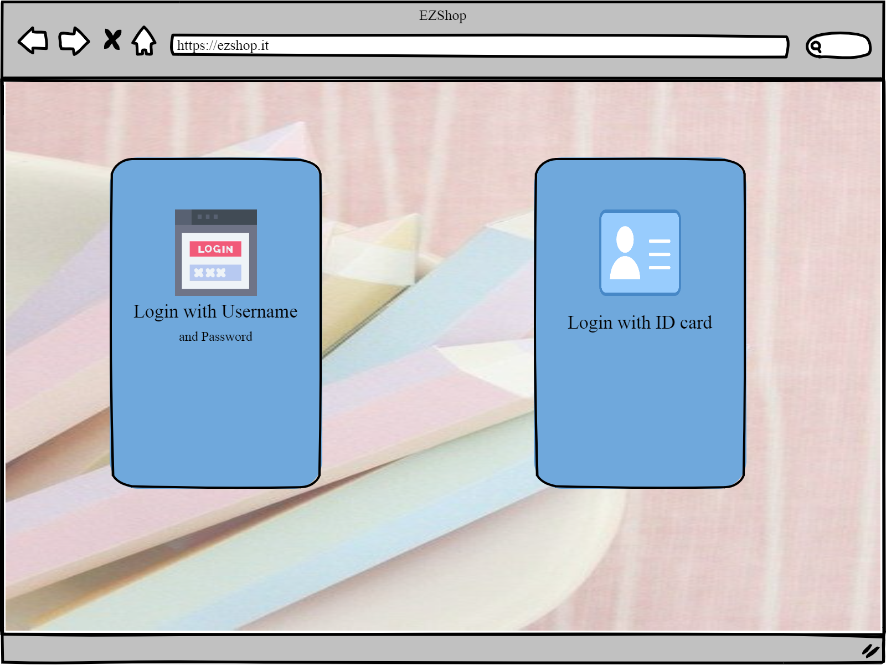

- The accountant is authenticated after entering username and password  

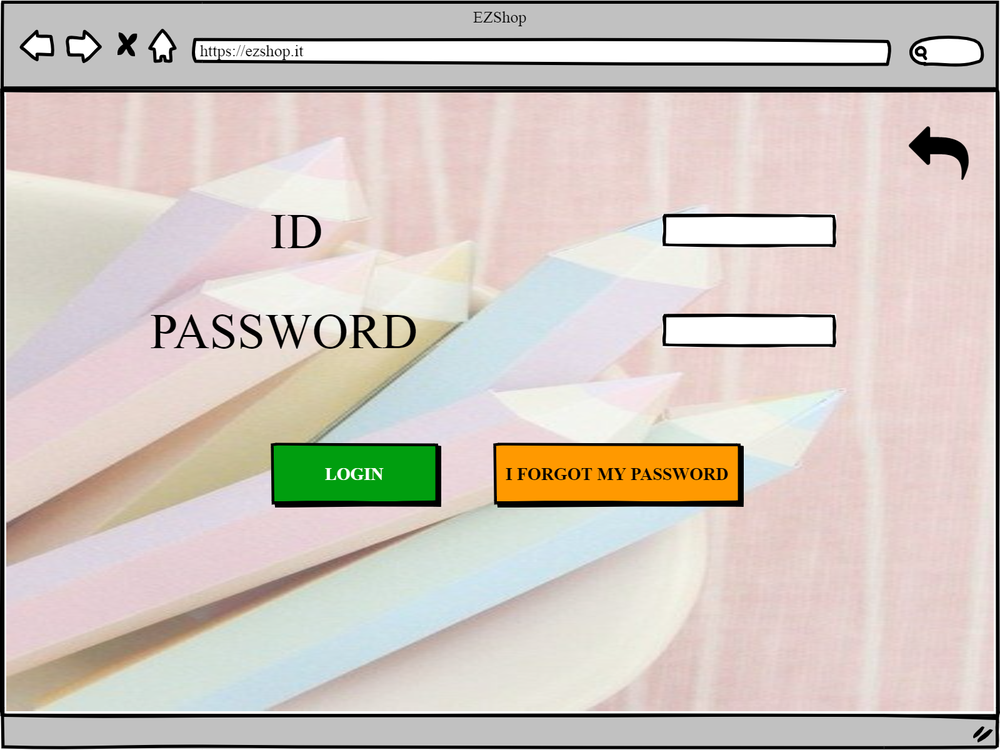

- The manager is directed to the sencond step of authentication 

 

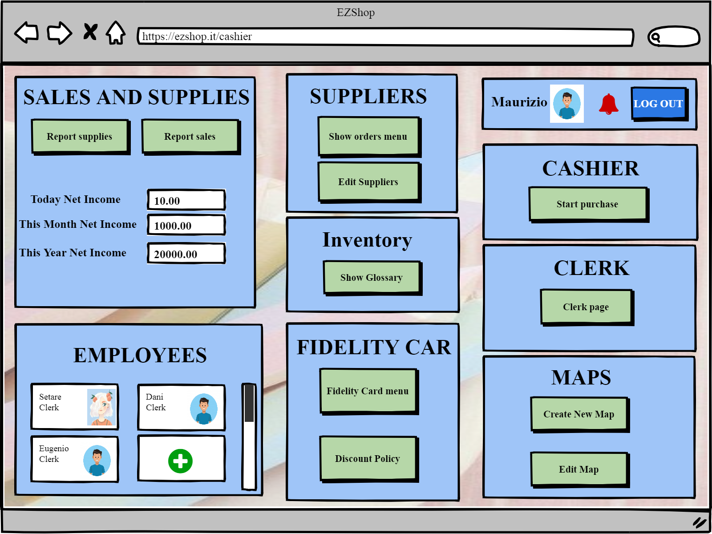

# Scenario 3.2.1

- Authentication of others (except manager)( one way authentication)
- Authentication of cashier and the clerk is by their ID card

 

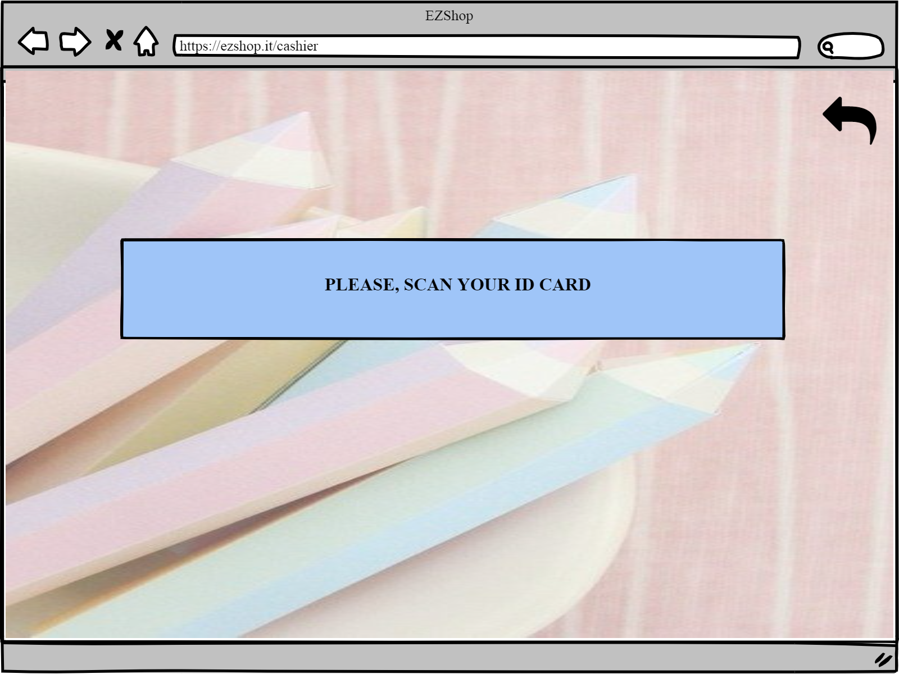

- Then the clerk is directed to:

 

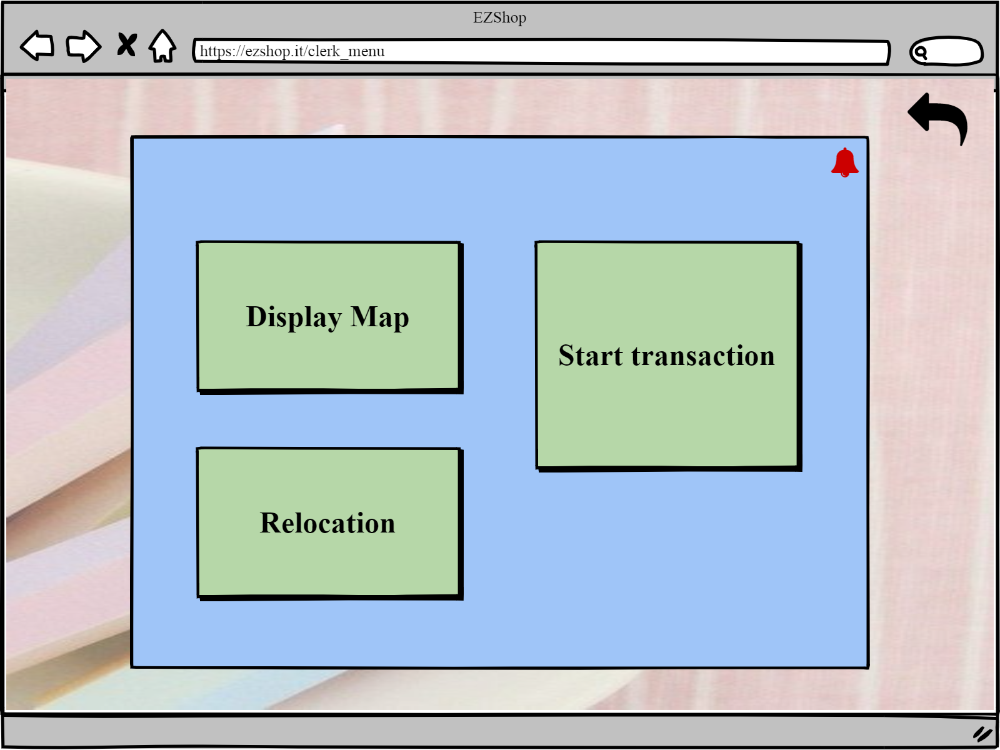

- And the cashier is directed to:

 

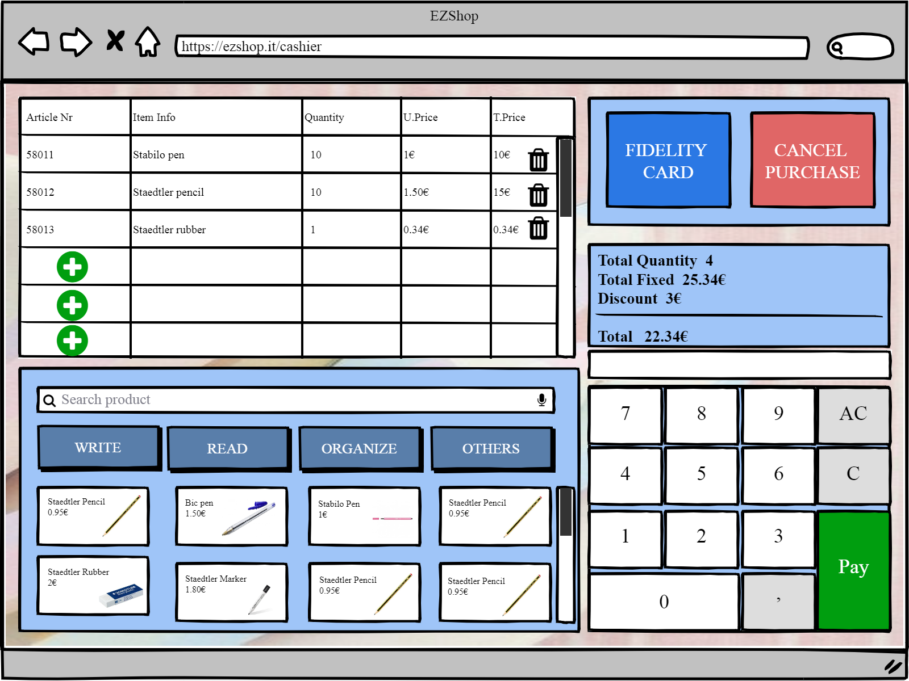

# Scenario 3.2.3

The software doesn’t recognise the code of the ID card

 

 

# Scenario 3.2.4

Accountant/manager forget the password

 

 

 

 

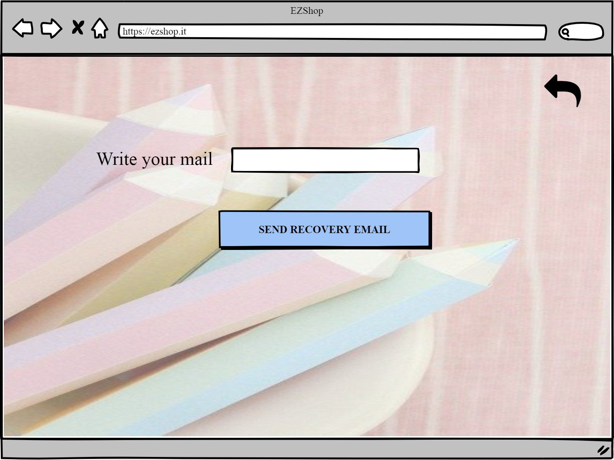

 

### Use case 4

Show statistics of the stationery store

# Scenario 4.1

Show statistics of sales

 

# Scenario 4.2

Show statistics of supplies

 

### Use case 5, UC5

Manage discount for fidelity card

# Scenario 5.1

Adding new discount

 

 

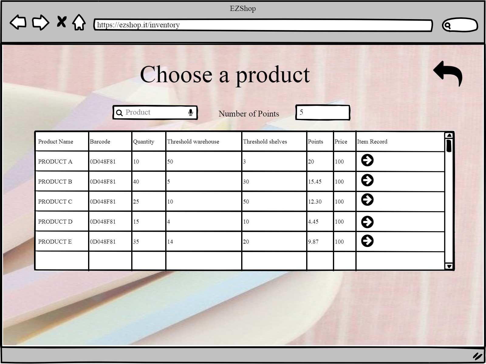

 

# Scenario 5.2

Edit discount

 

# Scenario 5.3

Change Points Policy

 

### Use case 6, UC6

Create and edit fidelity cards

# Scenario 6.1

Show the fidelity card lists and their owner

 

 

# Scenario 6.2

Edit information of fidelity card owner

 

 

# Scenario 6.3

Create fidelity card

 

 

 

### Use case 7, UC7

Define and edit accounts

# Scenario 7.1

Create a new account

 

 

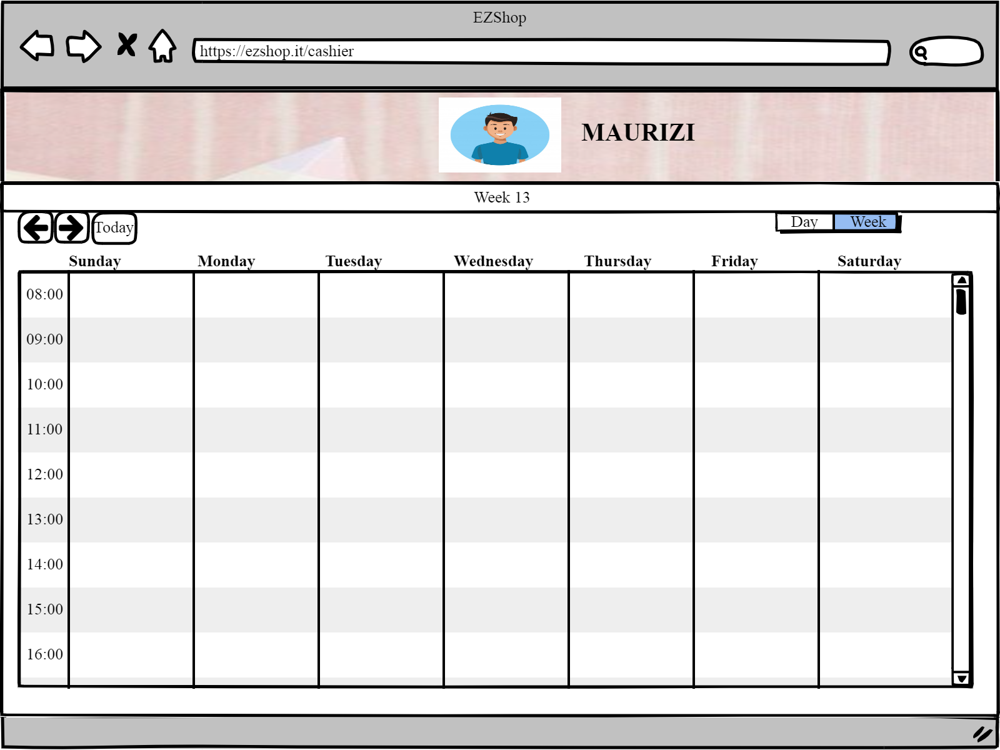

 

# Scenario 7.2

Edit account

 

 

 

### Use case 8, UC8

Location of the products is set by the manager

# Scenario 8.1

Manager creates a map of the shop with the location of the products

 

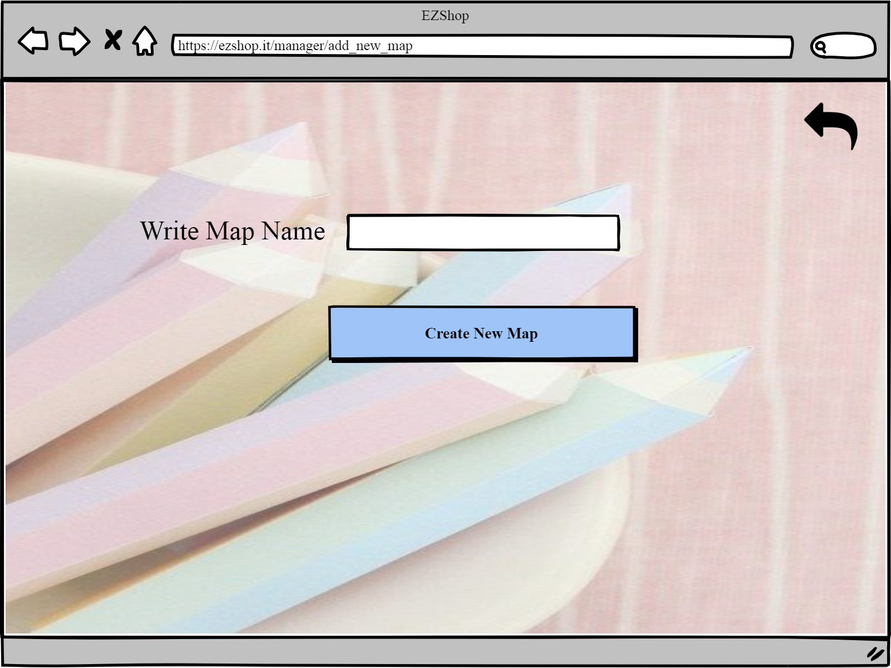

 

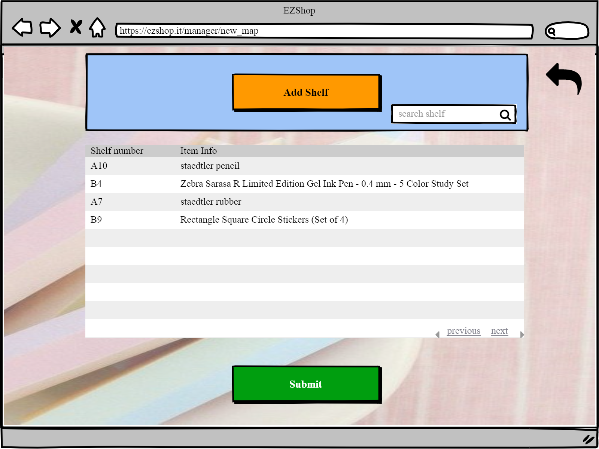

 

 

# Scenario 8.2

Manager edits one map

 

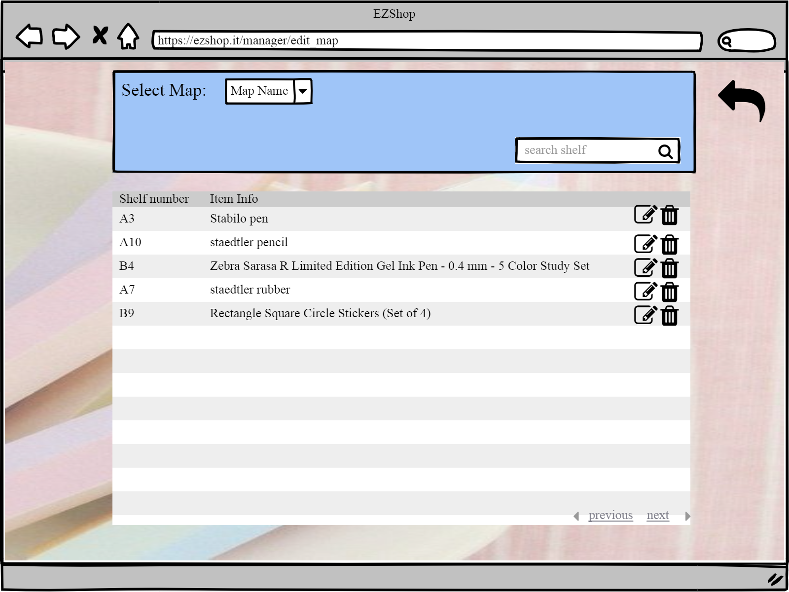

 

 

### Use case 9, UC9

Location of products is showed to clerk

Soon to be out of stocks product raise an alert through the bell icon to the manager 

 
- Soon to be out of stock products in the shelf raise an alert through the bell icon to the clerk 
# Scenario 9.1

Display map

 
- The products are shown 

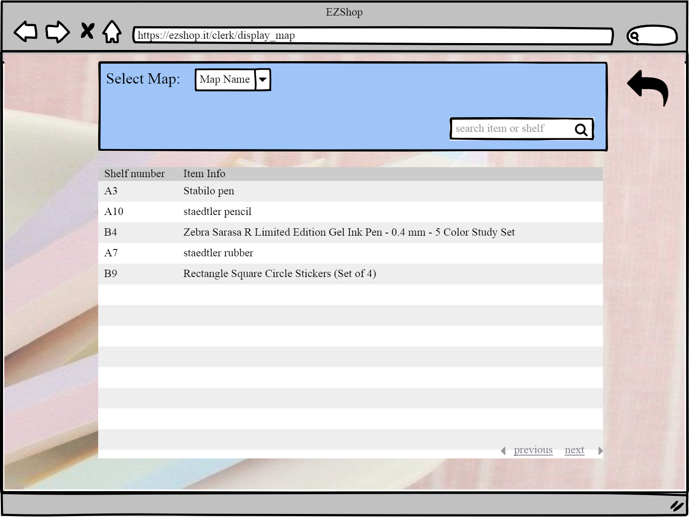

 

### Use case 10, UC10

Show, Edit and create organizational information

# Scenario 10.1

Show information of employees

 

 

# Scenario 10.2 and Scenario 10.3

- Show information of suppliers
- Edit information of suppliers

 

 
- All the information about the suppliers is shown   

**Edit information of suppliers**

- The manager clicks on the supplier editor icon and modify the editable fields. 

- Then clicks on "add product"  

- Then comes back and clicks save 

# Scenario 10.4

Create a new supplier

 

 

 

# Scenario 10.5

Show all the trasaction

 

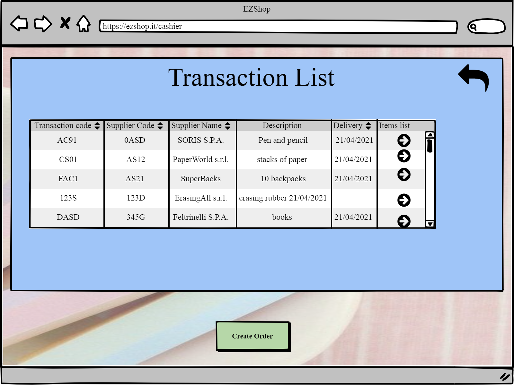

 

# Scenario 10.6

Create an order from a supplier

 

 

- The manager chooses the supplier , searching it by code and name
- The manager clicks on choose item

 

- The manager modifies only the “input quantity” values of the needed products
- The manager clicks on “ create order”

 

