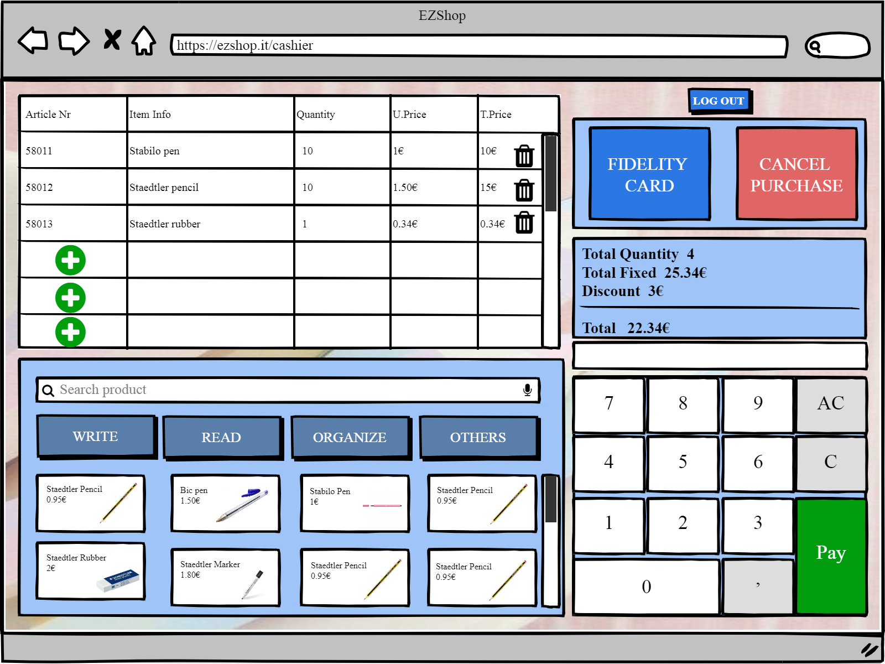

# Graphical User Interface Prototype

Authors:

Date:

Version:

### Use case 3, UC3

Authorize and authenticate

# Scenario 3.1 and Scenario 3.2.2

- Authentication of manager is a two step authentication
- Authentication of the accountant is by username and password

- The accountant is authenticated after entering username and password  

- The manager is directed to the sencond step of authentication 

 

# Scenario 3.2.1

- Authentication of others (except manager)( one way authentication)
- Authentication of cashier and the clerk is by their ID card

 

- Then the clerk is directed to:

 

- And the cashier is directed to:

 

# Scenario 3.2.3

The software doesn’t recognise the code of the ID card

 

 

# Scenario 3.2.4

Accountant/manager forget the password

 

 

 

 

 

### Use case 8, UC8

Location of the products is set by the manager

# Scenario 8.1

Manager creates a map of the shop with the location of the products

 

 

 

 

# Scenario 8.2

Manager edits one map

 

 

 
