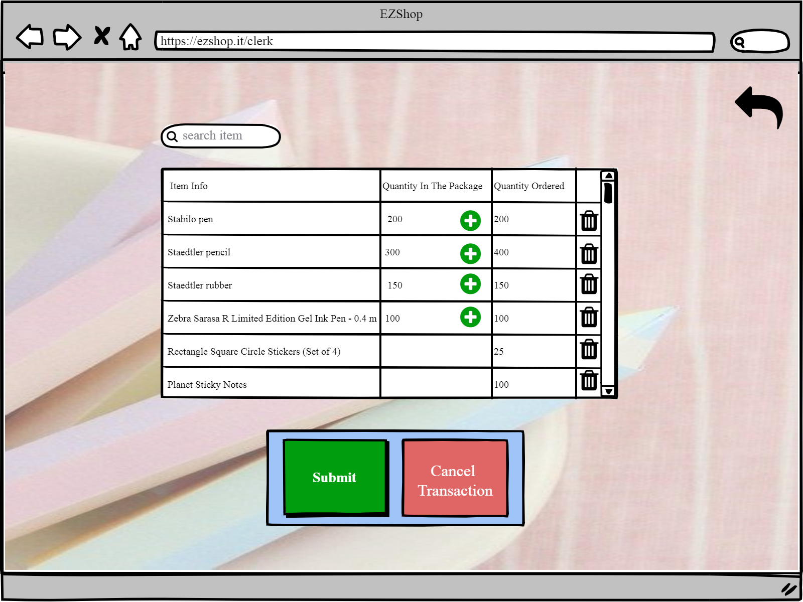

# Graphical User Interface Prototype

Authors:

Date:

Version:

### Use case 1, UC1

Handle sale transactions between cashier and customer

# Scenario 1.1.1

- To start a purchase, the cashier has just to start scanning products in their main page.  

- Once all the products are scanned, the cashier only will have to enter the amount of money that is going to paid (the cash given if cash of the exact amount purchased if credit card) and click in "Pay" 
- Then the cashier will have to choose the method of payment (credit card or cash) in the next view. 

- If the cashier chooses credit card, he/she will be redirected to the next view, where he/she will see the amount of money that will have to enter into the credit card reader.  
- Until the cashier does not click in new purchase, the ticket will not be printed and the transaction will not be registered   
- The cashier can also come back to the on going purchase by clicking in "come back" 

- If the cashier chooses cash, he/she will see the next view where it is possible to see the amount of money the cashier has to give back  
- Like in the previous case, once the button new purchase is clicked, the ticket will be printed and the purchase registered  

# Scenario 1.1.2

- For performing a purchase with fidelity card, the cashier has an option in their main page: "Fidelity Card". 
- The process is exactly the same as in the last scenario, the cashier only has to click in the "fidelity card" button in any moment during the purchase and ask the customer to scan it or also, the cashier can enter the Number of the card manually in the next view. 
- By clicking in Ok, the cashier can come back to the purchase. 

# Scenario 1.2

- In the main page, The cashier has the button "Cancel purchase" in the main. This way, he/she can easyly abort the transaction in any moment he/she desires. After clicking, he/she will be redirected to the main page again. 

# Scenario 1.3

- In the main page, the cashier can click in the little "trash" next to each product in order to delete a specific product from the purchase. 

# Scenarion 1.4

- If a product is not readable, the customer can enter manually the number of the product in the next view. 

Handle sale transaction between supplier  and  stationery shop

### Use case 1, UC1

Handle sale transaction between supplier  and  stationery shop

# Scenario 2.1

- The clerk is in their main page and clicks in start transaction. 

- The clerk chooses from the transaction list, the transaction (between shop and supplier) that he/she is going to check and registered. 

-In the next view, the clerk can add the actual quantity that is in the received package and compare it to the one ordered. 

- When the transaction is finished the clerk can click in submit, a certification will be printed and the clerk will be logget out  

# Scenario 2.2

- The clerk can abort the transaction just by clicking the "Cancel Transaction" button   

 
### Use case 3, UC3

Authorize and authenticate

# Scenario 3.1 and Scenario 3.2.2

- Authentication of manager is a two step authentication
- Authentication of the accountant is by username and password

- The accountant is authenticated after entering username and password  

- The manager is directed to the sencond step of authentication 

 

# Scenario 3.2.1

- Authentication of others (except manager)( one way authentication)
- Authentication of cashier and the clerk is by their ID card

 

- Then the clerk is directed to:

 

- And the cashier is directed to:

 

# Scenario 3.2.3

The software doesn’t recognise the code of the ID card

 

 

# Scenario 3.2.4

Accountant/manager forget the password

 

 

 

 

 

### Use case 4

Show statistics of the stationery store

# Scenario 4.1

Show statistics of sales

 

# Scenario 4.2

Show statistics of supplies

 

### Use case 5, UC5

Manage discount for fidelity card

# Scenario 5.1

Adding new discount

 

 

Manager chooses a product from the list

 

Manager insert manually in the list the discount and the point requested

# Scenario 5.2

Edit discount

 

Manager insert directly in the table the new discount and points request

# Scenario 5.3

Change Points Policy

 

### Use case 6, UC6

Create and edit fidelity cards

# Scenario 6.1

Show the fidelity card lists and their owner

 

The manager clicks on see customer profile item

 

# Scenario 6.2

Edit information of fidelity card owner

 

The manager clicks on see customer profile item

 

He modify the fields of the profile and save

 

He click on the delete icon and delete a fidelity card

# Scenario 6.3

Create fidelity card

 

 

He enters the fields of the profile and save

 

### Use case 7, UC7

Define and edit accounts

# Scenario 7.1

Create a new account

The manager clicks on the green “+” on EMPLOYEES section

 

He fills the form

 

He sets the weekly schedule of the employee

 

# Scenario 7.2

Edit account

 

 

 

### Use case 8, UC8

Location of the products is set by the manager

# Scenario 8.1

Manager creates a map of the shop with the location of the products

 

 

 

 

# Scenario 8.2

Manager edits one map

 

 

 

### Use case 9, UC9

Location of products is showed to clerk

# Scenario 9.1

Display map

 

 

### Use case 10, UC10

Show, Edit and create organizational information

# Scenario 10.1

Show information of employees

 

 

# Scenario 10.2 and Scenario 10.3

- Show information of suppliers
- Edit information of suppliers

 

 
- All the information about the suppliers is shown   

**Edit information of suppliers**

- The manager clicks on the supplier editor icon and modify the editable fields. 

- Then clicks on "add product"  

- Then comes back and clicks save 

# Scenario 10.4

Create a new supplier

 

 

 

# Scenario 10.5

Show all the trasaction

 

 

# Scenario 10.6

Create an order from a supplier

 

 

- The manager chooses the supplier , searching it by code and name
- The manager clicks on choose item

 

- The manager modifies only the “input quantity” values of the needed products
- The manager clicks on “ create order”

 

### Use case 11, UC11

Add/modify or delete a product record

# Scenario 11.1

- The manager can see the "Show Glossary option" to see the inventory from the main page below 
- The manager can just click in the item record icon to see the details of a certain product record 

- In the inventory page below, the manager can just click in the item record icon to see the details of a certain product record 

# Scenario 11.2
- The manager can see from the inventory page the threshold of a certain product that will set a alarm. In order to change this threshold, the manager just have to click in the corresponding "+". 
- The next

### Use case 12, UC12

Creating alarm for products reaching their threshold in quantity

# Scenario 12.1 and Scenario 12.2

Soon to be out of stocks product raise an alert through the bell icon to the manager

 
- Soon to be out of stock products in the shelf raise an alert through the bell icon to the clerk

 
- The products are shown

 
