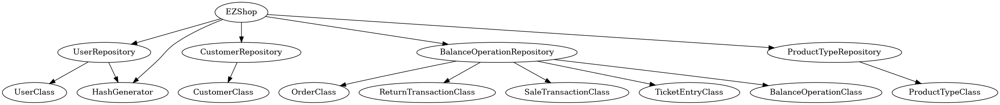

# Integration and API Test Documentation

Authors:

Date:

Version:

# Contents

- [Dependency graph](#dependency graph)

- [Integration approach](#integration)

- [Tests](#tests)

- [Scenarios](#scenarios)

- [Coverage of scenarios and FR](#scenario-coverage)
- [Coverage of non-functional requirements](#nfr-coverage)

# Dependency graph 

# Integration approach

    <Write here the integration sequence you adopted, in general terms (top down, bottom up, mixed) and as sequence
    (ex: step1: class A, step 2: class A+B, step 3: class A+B+C, etc)> 
    <Some steps may  correspond to unit testing (ex step1 in ex above), presented in other document UnitTestReport.md>
    <One step will  correspond to API testing>

  

  We adopted the **bottom-up** approach. 
    
  **Step 1** corresponds to unit testing, which consists of the leaves of the dependency graph. 
    
  **Step 2** consists of repository class tests which are dependent on models(step 1)
    
  **Step 3** (the root) is the EZShop class which contains all testing of the APIs'.  Inside each API test, methods of repositories are called.

#  Tests

   <define below a table for each integration step. For each integration step report the group of classes under test, and the names of
     JUnit test cases applied to them> JUnit test classes should be here src/test/java/it/polito/ezshop

## Step 1
| Classes  | JUnit test cases |
|--|--|
|UserClass|data/model/UserClassTest|
|CustomerClass|data/model/CustomerClassTest|
|HashGenerator|data/util/HashGeneratorTest|
|ReturnTransactionClass|data/model/ReturnTransactionClassTest|
|SaleTransactionClass|data/model/SaleTransactionClassTest|
|TicketEntryClass|data/model/TicketEntryClassTest|
|OrderClass|data/model/OrderClassTest|
|BalanceOperationClass|data/model/BalanceOperationClassTest|
|ProductTypeClass|data/model/ProductTypeClassTest|
|EZShop (only methods that are not api)|data/EZShopTest|

## Step 2
| Classes  | JUnit test cases |
|--|--|
|CustomerClass + CustomerRepository|data/repository/CustomerRepositoryTest|
|[UserClass+HashGenerator] + UserRepository|data/repository/UserRepositoryTest|
|ProductTypeClass + ProductTypeRepository|data/repository/ProductTypeRepositoryTest|
|[SaleTransactionClass+ReturnTransactionClass+TicketEntryClass+OrderClass] + BalanceOperationRepository|data/repository/BalanceOperationRepositoryTest|

## Step 3 

   

| Classes  | JUnit test cases |
|--|--|
|EZShop|data/FR1Test data/FR3Test data/FR4Test data/FR5Test data/FR6Test data/FR7Test data/FR8Test |

# Scenarios

<If needed, define here additional scenarios for the application. Scenarios should be named
 referring the UC in the OfficialRequirements that they detail>

## Scenario UC2.4

| Scenario | Delete Customer |
| ------------- |:-------------:|
|  Precondition     | Account U for Customer Cu existing |
|  Post condition     | Account U for Customer Cu is deleted |
| Step#        | Description  |
|  1     | User selects customer record C |
|  2     | User deletes the record C |

## 

# Coverage of Scenarios and FR

<Report in the following table the coverage of  scenarios (from official requirements and from above) vs FR. 
Report also for each of the scenarios the (one or more) API JUnit tests that cover it. >

| Scenario ID | Functional Requirements covered | JUnit  Test(s) (all of them are in src/test/java/it/polito/ezshop/data) |
| ----------- | ------------------------------- | ----------- |
|  1.1        | FR3 |data/FR3.testCreateProductType() |
|  1.2        | FR4 |data/FR4.testUpdatePosition() |
|  1.3        | FR3|data/FR3.testUpdateProduct() |
|  2.1      | FR1 | FR1Test.testCreateUser()|
|  2.2      | FR1 | FR1Test.testDeleteCustomer() |
| 2.3      | FR1 | FR1Test.testUpdateUserRigths() |
| 4.1      | FR5 | FR5Test.testDefineCustomer() |
| 4.2      | FR5 | FR5Test.testAttachCardToCustomer() |
| 4.3      | FR5 | FR5Test.testAttachCardToCustomer() |
| 4.4 | FR5 | FR5Test.testModifyCustomer() |
| 7.1 | FR7 | FR7.testReceiveCreditCardPayment() |
| 7.2 | FR7 | FR7.testReceiveCreditCardPayment() |
| 7.3 | FR7 | FR7.testReceiveCreditCardPayment() |
| 7.4 | FR7 | FR7.testReceiveCashPayment() |
| 8.1 |                                 |  |
| 8.2 |  |  |
| 10.1 | FR7 | FR7.testReturnCreditCardPayment() |
| 10.2 | FR7 | FR7.testReturnCashPayment() |

# Coverage of Non Functional Requirements

<Report in the following table the coverage of the Non Functional Requirements of the application - only those that can be tested with automated testing frameworks.>

### 

| Non Functional Requirement | Test name |
| -------------------------- | --------- |
|                            |           |

