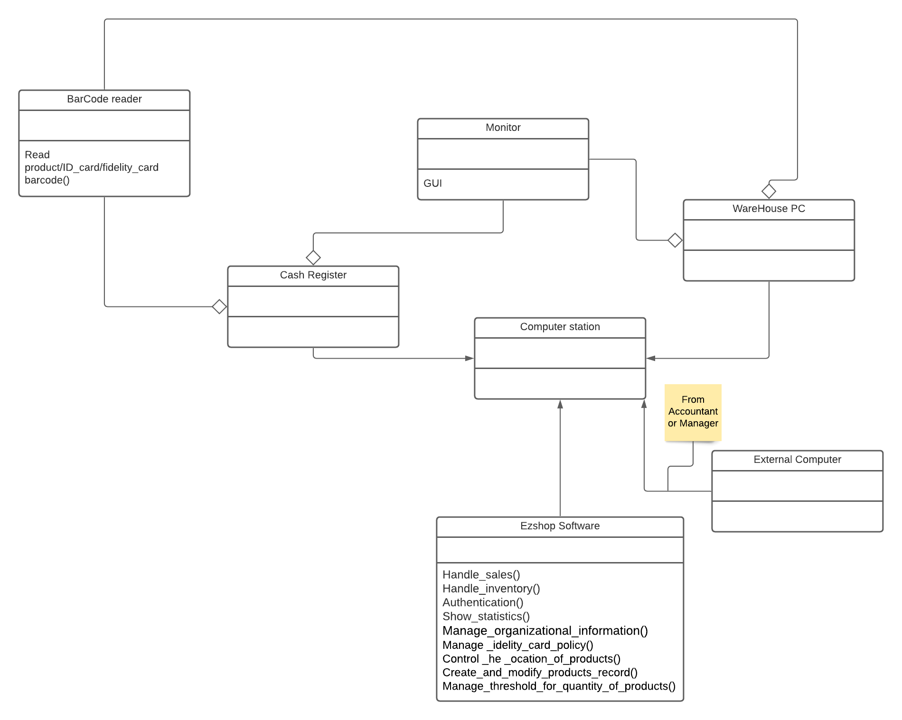

# Requirements Document

Authors: Setareh Askarifirouzjaei s288485, Ressa Eugenio s281642, Daniel Peña López s286489

Date: 21 april 2021

Version: 1.1

# Contents

- [Essential description](#essential-description)
- [Stakeholders](#stakeholders)
- [Context Diagram and interfaces](#context-diagram-and-interfaces)
  - [Context Diagram](#context-diagram)
  - [Interfaces](#interfaces)
- [Stories and personas](#stories-and-personas)
- [Functional and non functional requirements](#functional-and-non-functional-requirements)
  - [Functional Requirements](#functional-requirements)
  - [Non functional requirements](#non-functional-requirements)
- [Use case diagram and use cases](#use-case-diagram-and-use-cases)
  - [Use case diagram](#use-case-diagram)
  - [Use cases](#use-cases) + [Relevant scenarios](#relevant-scenarios)
- [Glossary](#glossary)
- [System design](#system-design)
- [Deployment diagram](#deployment-diagram)

# Essential description

In order to maintain a stationary shop(cartoleria) a lot of paperwork is needed. People who work in this type of work, want something that can keep track of all that involves the shop.
EZshop is a service that allows a stationery shop to monitor all the activity that is carried out in the shop virtually without using tons of paper and wasting time.
In particular, the application can:

- Store information about employees in the shop and orders to suppliers. Also, the application provides easy access to this information.
- See statistics about the sales of the shop and the orders made to suppliers.
- Register the sales automatically in the system when a purchase is performed.
- Keep track of the amount of products that are present in the shelves of the shop and warehouse.
- Manage a fidelity card system that the customers can use in order to get discounts.

EZshop is supported by a web application (accessible via PC), with different levels of access depending on your role in the shop.

# Stakeholders

| Stakeholder name | Description                                                                                                                                                                                                                                                                                                                                                                                                                          |
| ---------------- | ------------------------------------------------------------------------------------------------------------------------------------------------------------------------------------------------------------------------------------------------------------------------------------------------------------------------------------------------------------------------------------------------------------------------------------ |
| Customer         | Person who buys and may own a fidelity card.                                                                                                                                                                                                                                                                                                                                                                                         |
| Product          | Item that is sold in the shop.                                                                                                                                                                                                                                                                                                                                                                                                       |
| Manager/Owner    | Person who is charge of handling various operational aspects such as managing inventories, budgeting, ordering products, analyzing sales performance and organizational information                                                                                                                                                                                                                                                  |
| Accountant       | Person who manag money flow.   Prepare and examine financial records.                                                                                                                                                                                                                                                                                                                                                             |
| Cashier          | Person who performs transactions between the stationary shop and the customer.                                                                                                                                                                                                                                                                                                                                                       |
| Clerk            | Person who is in charge of the procedure from receiving the packages from the suppliers to refills the store shelves. This includes keep track of the amount of products that are in the packages received, organize them in the warehouse and colocate a product in a shelf in base of a map of the shop that was created by the Manager  This person is also in charge of helping the customers to find their desired products. |
| Developer        | Responsible for creating and working in the development of the project.                                                                                                                                                                                                                                                                                                                                                              |
| Maintainer       | Responsible of controlling that the software works correctly (solving bugs, adding new features)                                                                                                                                                                                                                                                                                                                                     |
| Supplier         | Entity that supplies new goods for the shop.                                                                                                                                                                                                                                                                                                                                                                                         |

# Context Diagram and interfaces

## Context Diagram

## Interfaces

| Actor         | Logical Interface     | Physical Interface                      |
| ------------- | --------------------- | --------------------------------------- |
| Cashier       | GUI + ID barcode      | Barcode reader + monitor,keyboard (POS) |
| Clerk         | GUI+barcode           | Barcode reader + monitor                |
| Manager/Owner | GUI                   | Manager Device                          |
| Accountant    | GUI                   | Accountant Device                       |
| Product       | Bar code              | Barcode reader                          |
| Customer      | Fidelity card barcode | Barcode reader                          |

# Stories and personas

**ELISA**
  Elisa is the manager of the shop. She is a 55 year old woman who is used to working as a traditional shop owner since she was child. But, she wants to modernize her shop with new technology. Right now, she manages accounting by hand and she spends a great part of the day with tons of paper trying to organize her shop. Because of that, what she wants is an application with all the paper about the information of her employees, what she has ordered to the supplier and statistics about what she has sold.   

**TOM**
  Tom is a 30 years old man who is a new cashier in the stationer’s shop. He is very nervous because he does not know how to use the software of the POS. Another cashier explained to him quickly how to use the device but he was so nervous that he could not understand the explanation properly. His turn has just started and his first client starts putting the products in the table. The customer is in a hurry and Tom only wants to be guided through the process by the POS.   

**TIM**
  Tim at age 35 is a clerk at the stationer’s shop. A truck from the supplier has arrived at the warehouse. So, he goes there and receives the new products. He wants to enter the information of the new products quickly and without mistakes. He scans each product one by one.  
Some hours later a customer is asking for the location of Stabilo pencils. Tom goes to the location of Stabilo pencils and notices that the Stabilo pencils shelf is empty. He goes directly to the warehouse, picks some amount of Stabilo pencils. Then he returns to the shop and fills the shelf.   

**SARA**
 Sara, 40, is an accountant at a stationer’s shop. Today is a working day and her task is to check the financial performance of the stationary shop.She has to check several papers to do her work and it is very time-consuming. Sometimes, because of this mess, she makes errors and has a wrong financial record.
She would like a digital database with all sold products that can scroll and filter in order to create good financial records.   

**PAOLO**
 Paolo is a 14-years old guy and his mother has given him the fidelity card and she has asked him to use it when he goes to buy a pencil. Since it is his first time there, he just wants an easy way to scan the fidelity card. He would like something that indicates him exactly where the barcode of the card has to be scanned and simply shows it without doing anything else. 

# Functional and non functional requirements

## Functional Requirements

| ID                        | Description                                                                                                                                |
| ------------------------- | ------------------------------------------------------------------------------------------------------------------------------------------ |
| **FR1**                   | Handle sale transaction between customer and stationery shop                                                                               |
| &emsp;FR1.1               | Read the barcode (of the products, the fidelity card, ID card)                                                                             |
| &emsp;FR1.2               | Applying the discount to the price                                                                                                         |
| &emsp;FR1.3               | Supporting two different payment method(cash and credit card)                                                                              |
| &emsp;FR1.4               | End the purchase                                                                                                                           |
| &emsp;&emsp;&emsp;FR1.4.1 | Update Statistics of available products according to the changes in the amount of each product sold                                        |
| &emsp;&emsp;&emsp;FR1.4.2 | Check if new alarms must be activated in order to add more products in the shelves and warehouse (according to pre established thresholds) |
| **FR2**                   | Handle sale transaction between supplier and stationery store                                                                              |
| &emsp;FR2.1               | Check correctness of the transaction                                                                                                       |
| &emsp;&emsp;&emsp;FR2.1.1 | Count quantity in the package                                                                                                              |
| &emsp;&emsp;&emsp;FR2.1.2 | Display quantity ordered                                                                                                                   |
| &emsp;FR2.2               | End the transaction                                                                                                                        |
| &emsp;&emsp;&emsp;FR2.2.1 | Update Statistics according to the new amount of each product                                                                              |
| **FR3**                   | Authorize and authenticate                                                                                                                 |
| &emsp;FR3.1               | Define and edit account                                                                                                                    |
| &emsp;&emsp;&emsp;FR3.1.1 | Send automatically the credentials for logging when a profile is created                                                                   |
| &emsp;&emsp;&emsp;FR3.1.2 | Option for retrieving the forgotten password                                                                                               |
| &emsp;FR3.2               | Authenticate the manager ( multi-factor authentication)                                                                                    |
| &emsp;FR3.3               | Authenticate the rest of the employees                                                                                                     |
| &emsp;&emsp;&emsp;FR3.3.1 | Authenticate through username and password                                                                                                 |
| &emsp;&emsp;&emsp;FR3.3.2 | Authenticate through the ID card                                                                                                           |
| &emsp;FR3.4               | Log out                                                                                                                                    |
| **FR4**                   | Show statistics of the stationery store                                                                                                    |
| &emsp;FR4.1               | Filtering data by different features                                                                                                       |
| &emsp;&emsp;&emsp;FR4.1.1 | Report sales                                                                                                                               |
| &emsp;&emsp;&emsp;FR4.1.2 | Report supplies                                                                                                                            |
| **FR5**                   | Manage organizational information                                                                                                          |
| &emsp;FR5.1               | Display and edit information about employees                                                                                               |
| &emsp;FR5.2               | Display and edit information about suppliers                                                                                               |
| &emsp;&emsp;&emsp;FR5.2.1 | Create and Manage orders                                                                                                                   |
| **FR6**                   | Manage fidelity card policy                                                                                                                |
| &emsp;FR6.1               | Possibility to add and edit discounts to products for fidelity card owners                                                                 |
| &emsp;FR6.2               | Add points to the products                                                                                                                 |
| &emsp;FR6.3               | Link a specific reward (amount of money) for each point                                                                                    |
| &emsp;FR6.4               | Create,edit and delete a fidelity card for a customer (including information of Customer)                                                  |
| **FR7**                   | Control the location of products                                                                                                           |
| &emsp;FR7.1               | Create a map that represents the location of the products in the shelves                                                                   |
| &emsp;FR7.2               | Edit a map that represents the location of the products in the shelves                                                                     |
| &emsp;FR7.3               | Display map that represents the location of the products in the shelves                                                                    |
| &emsp;FR7.4               | Relocation of products from warehouse to shelves                                                                                           |
| **FR8**                   | Create and modify products record                                                                                                          |
| **FR9**                   | Manage threshold for quantity of products in warehouse and shelves                                                                         |
| &emsp;FR9.1               | Set threshold                                                                                                                              |
| &emsp;FR9.2               | Send alarms for products reaching their threshold                                                                                          |

## Non Functional Requirements

| ID   | Type (efficiency, reliability, ..) | Description                                                                             | Refers to |
| ---- | ---------------------------------- | --------------------------------------------------------------------------------------- | --------- |
| NFR1 | Security                           | Access to the software only through local network                                       | FR3       |
| NFR2 | Usability                          | In 30 minutes a new cashier can learn how to use the software                           | FR1       |
| NFR3 | Security                           | Access to the software only through authentication                                      | FR3       |
| NFR4 | Usability                          | Time between product's barcode is scanned and name of the product shown in monitor < 1s | FR1,FR2   |

# Use case diagram and use cases

## Use case diagram

### Use case 1, UC1

Handle sale transactions between cashier and customer

| Actors Involved  | Cashier, Products customer                                                                                                                                                                                                         |
| ---------------- | ---------------------------------------------------------------------------------------------------------------------------------------------------------------------------------------------------------------------------------- |
| Precondition     | - The cashier is in the cash register location and the cash register is unlocked by authentication  - No ongoing transaction in the current cash register.  - The POS is working.  - The cash register shouldn’t be empty |
| Post condition   | - The transaction is terminated.                                                                                                                                                                                                   |
| Nominal Scenario | Scenario 1.1.1 1.1.2                                                                                                                                                                                                               |
| Variants         | Scenario 1.2 1.3 1.4                                                                                                                                                                                                               |

##### Scenario 1.1.1

Transaction between the cashier and the customer without fidelity card

| Scenario 1.1.1 |                                                                                                                                                                                                                                    |
| -------------- | ---------------------------------------------------------------------------------------------------------------------------------------------------------------------------------------------------------------------------------- |
| Precondition   | - The cashier is in the cash register location and the cash register is unlocked by authentication  - No ongoing transaction in the current cash register.  - The POS is working.  - The cash register shouldn’t be empty |
| Post condition | - The amount in cash after transaction = amount in cash before transaction + T  - The transaction is recorded by the software  - All the products are scanned by the barcode reader.  - The inventory is updated          |
| Step#          | Description                                                                                                                                                                                                                        |
| 1              | Start the transaction                                                                                                                                                                                                              |
| 2              | Retrieve name and price by reading barcode of a product                                                                                                                                                                            |
| 3              | Repeat step 2 for all products                                                                                                                                                                                                     |
| 4              | Compute total T                                                                                                                                                                                                                    |
| 5              | Choose between cash or credit card payment                                                                                                                                                                                         |
| 6              | Manage payment and cash amount T                                                                                                                                                                                                   |
| 7              | Print receipt                                                                                                                                                                                                                      |
| 8              | Register the transaction in the software                                                                                                                                                                                           |
| 9              | Close transaction                                                                                                                                                                                                                  |

##### Scenario 1.1.2

Transaction between the cashier and the customer with fidelity card

| Scenario 1.1.2 |                                                                                                                                                                                                                                                                           |
| -------------- | ------------------------------------------------------------------------------------------------------------------------------------------------------------------------------------------------------------------------------------------------------------------------- |
| Precondition   | - The cashier is in the cash register location and the cash register is unlocked by authentication  - No ongoing transaction in the current cash register.  - The POS is working.  - The cash register shouldn’t be empty  - The customer has a fidelity card |
| Post condition | - The amount in cash after transaction = amount in cash before transaction + T  - The transaction is recorded by the software  - All the products are scanned by the barcode reader.  - The inventory is updated                                                 |
| Step#          | Description                                                                                                                                                                                                                                                               |
| 1              | Start the transaction                                                                                                                                                                                                                                                     |
| 2              | Read barcode of fidelity card                                                                                                                                                                                                                                             |
| 3              | Retrieve name and price by reading barcode of a product                                                                                                                                                                                                                   |
| 4              | Apply discount for fidelity card                                                                                                                                                                                                                                          |
| 5              | Repeat step 3 and 4 for all products                                                                                                                                                                                                                                      |
| 6              | Compute total T                                                                                                                                                                                                                                                           |
| 7              | Choose between cash or credit card payment                                                                                                                                                                                                                                |
| 8              | Add points to the fidelity card                                                                                                                                                                                                                                           |
| 9              | Manage payment and cash amount T                                                                                                                                                                                                                                          |
| 10             | Print receipt                                                                                                                                                                                                                                                             |
| 11             | Register the transaction in the software                                                                                                                                                                                                                                  |
| 12             | Close transaction                                                                                                                                                                                                                                                         |

##### Scenario 1.2

The transaction is aborted.
| Scenario 1.2 | |
| -------------- | ------------------------------------------------------------------------------------------------------------------------------------------------------------------------------------------------------------------------------------------------------------------------ |
| Precondition | - The cashier is in the cash register location and the cash register is unlocked by authentication  - No ongoing transaction in the current cash register.  - The POS is working.  - The cash register shouldn’t be empty|
| Post condition | - The transaction is aborted |
| Step# | Description |
| 1 | Start the transaction |
| 2 | Retrieve name and price by reading barcode of a product |
| 3 | Repeat step 2 for all products |
| 4 | The cashier asks to abort the transaction T |
| 5 | Close transaction |

##### Scenario 1.3

Transaction between the cashier and the customer but some product is deleted during the transaction
| Scenario 1.3| |
| -------------- | ------------------------------------------------------------------------------------------------------------------------------------------------------------------------------------------------------------------------------------------------------------------------ |
| Precondition | - The cashier is in the cash register location and the cash register is unlocked by authentication  - No ongoing transaction in the current cash register.  - The POS is working.  - The cash register shouldn’t be empty |
| Post condition | - The amount in cash after transaction = amount in cash before transaction + T  - The transaction is recorded by the software  - All the products are scanned by the barcode reader.  - The inventory is updated |
| Step# | Description |
| 1 | Start the transaction |
| 2 | Retrieve name and price by reading barcode of a product |
| 3 | Repeat step 2 for all products |
| 4 | The barcode of the product to be removed product is read |
| 5 | The product is removed from the list of transaction |
| 6 | Repeat steps 4 and 5 for all the products to be removed|
| 7 | Compute total amount T|
| 8 | Choose between cash or credit card payment |
| 9 | Manage payment and cash amount T |
| 10 | Print receipt |
| 11 | Register the transaction in the software |
| 12 | Close transaction |

##### Scenario 1.4

Transaction between the cashier and the customer but some barcode is not readable
| Scenario 1.4 | |
| -------------- | ------------------------------------------------------------------------------------------------------------------------------------------------------------------------------------------------------------------------------------------------------------------------ |
| Precondition | - The cashier is in the cash register location and the cash register is unlocked by authentication  - No ongoing transaction in the current cash register.  - The POS is working.  - The cash register shouldn’t be empty
| Post condition | - The amount in cash after transaction = amount in cash before transaction + T  - The transaction is recorded by the software  - All the products are scanned by the barcode reader.  - The inventory is updated |
| Step# | Description |
| 1 | Start the transaction |
| 2 | Retrieve name and price by reading barcode of a product |
| 3 | Repeat step 2 for all products |
| 4 | Input the barcode of the product manually|
| 5 | Repeat step 6 for all products which can’t be read by the barcode reader|
| 6 | Compute total T |
| 7 | Choose between cash or credit card payment |
| 8 | Add points to the fidelity card |
| 9 | Manage payment and cash amount T |
| 10 | Print receipt |
| 11 | Register the transaction in the software |
| 12 | Close transaction |

### Use case 2, UC2

Handle sale transaction between supplier and stationery shop

| Actors Involved  | Clerk, Products                                                                |
| ---------------- | ------------------------------------------------------------------------------ |
| Precondition     | - Authentication of the clerk  - The barcode reader and monitor are working |
| Post condition   | - The transaction is terminated  - The clerk is logged out.                 |
| Nominal Scenario | Scenario 2.1                                                                   |
| Variants         | Scenario 2.2                                                                   |

# Scenario 2.1

Good transaction

| Scenario 2.1   |                                                                                                                |
| -------------- | -------------------------------------------------------------------------------------------------------------- |
| Precondition   | - Authentication of the clerk   - The monitor in the warehouse is working                                   |
| Post condition | - The transaction is terminated   -The transaction is recorded by the software  -The clerk is logged out |
| Step#          | Description                                                                                                    |
| 1              | Start transaction                                                                                              |
| 2              | Choose from transaction list                                                                                   |
| 3              | Retrieve name from the list of transaction’s product                                                           |
| 4              | Input the quantity of the product                                                                              |
| 5              | Repeat step 2 and 3 for each product                                                                           |
| 6              | End insertion of products                                                                                      |
| 7              | Register the transaction in the software                                                                       |
| 8              | Print a certification                                                                                          |
| 9              | End transaction                                                                                                |

# Scenario 2.2

Transaction done but some product was removed

| Scenario 2.2   |                                                             |
| -------------- | ----------------------------------------------------------- |
| Precondition   | - Authentication of the clerk   - The monitor is working |
| Post condition | - The transaction is aborted                                |
| Step#          | Description                                                 |
| 1              | Start transaction                                           |
| 2              | Choose from transaction list                                |
| 3              | Retrieve name from the list of transaction’s product        |
| 4              | Input the quantity of the product                           |
| 5              | Repeat step 2 and 3 for each product                        |
| 6              | The transaction is aborted                                  |
| 7              | The transaction file is deleted                             |
| 8              | Print a certification                                       |
| 9              | End transaction                                             |

### Use case 3, UC3

Authorize and authenticate

| Actors Involved  | Manager, Clerk, Cashier, Accountant                   |
| ---------------- | ----------------------------------------------------- |
| Precondition     |                                                       |
| Post condition   | - They gain access to the software in different modes |
| Nominal Scenario | Scenario 3.1,3.2.1,3.2.2                              |
| Variants         | Scenario 3.2.3,3.2.4                                  |

# Scenario 3.1

authentication of manager ( two authentication)

| Scenario 3.1   |                                                                                                                |
| -------------- | -------------------------------------------------------------------------------------------------------------- |
| Precondition   |                                                                                                                |
| Post condition | The manager gains access to the software in different mode                                                     |
| Step#          | Description                                                                                                    |
| 1              | The manager clicks in the “login with username and password” button.                                           |
| 2              | Manager inputs the username and password in the login page of the software                                     |
| 3              | The software checks the username and password                                                                  |
| 4              | The software is directed to a new page which asks to enter the 6 digit code sent to the manager's mobile phone |
| 5              | The manager enters the code.                                                                                   |
| 6              | Authentication is done                                                                                         |

# Scenario 3.2.1

Authentication of others (except manager)( one way authentication)
we authenticate a cashier and the clerk by their ID card

| Scenario 3.2.1 |                                                            |
| -------------- | ---------------------------------------------------------- |
| Precondition   |                                                            |
| Post condition | - Cashier and clerk gain access to the software            |
| Step#          | Description                                                |
| 1              | The employee clicks in the “use ID card” button.           |
| 2              | The employee scans their ID card through an ID card reader |
| 3              | The software recognizes the employee ID code               |
| 4              | Authentication is done                                     |

# Scenario 3.2.2

Authenticate the accountant by ID+password through a GUI

| Scenario 3.2.2 |                                                                           |
| -------------- | ------------------------------------------------------------------------- |
| Precondition   |                                                                           |
| Post condition | - Accountant gains access to the software                                 |
| Step#          | Description                                                               |
| 1              | The accountant clicks in the “login with username and password” button.   |
| 2              | Accountant enters username and password in the login page of the software |
| 3              | The software checks the username and password                             |
| 4              | Authentication is done                                                    |

# Scenario 3.2.3

The software doesn’t recognise the code of the ID card

| Scenario 3.2.3 |                                                            |
| -------------- | ---------------------------------------------------------- |
| Precondition   |                                                            |
| Post condition | - Employee is not authenticated                            |
| Step#          | Description                                                |
| 1              | The employee clicks in the “login with ID card” button.    |
| 2              | The employee scans their ID card through an ID card reader |
| 3              | The software doesn’t recognise the ID code                 |
| 4              | The authentication fails                                   |

# Scenario 3.2.4

Manager/accountant inputs wrong credential

| Scenario 3.2.4 |                                                                                                  |
| -------------- | ------------------------------------------------------------------------------------------------ |
| Precondition   |                                                                                                  |
| Post condition | - Accountant/manager gains access to the software                                                |
| Step#          | Description                                                                                      |
| 1              | Accountant/ manager clicks on the “use username and password” button                             |
| 2              | Accountant/manager enters username and password in the login page of the software                |
| 3              | The software check username and password and displays an error message for the wrong password    |
| 4              | Accountant/manager clicks on “I forgot my password”’                                             |
| 5              | The software displays a message which asks to check the new email sent to the accountant/manager |
| 6              | Accountant/manager retrieves the password from the email                                         |
| 7              | Accountant/manager enters username and password in login page                                    |
| 8              | Software checks the username and password                                                        |
| 9              | Authentication is done                                                                           |

### Use case 4, UC4

Show statistics of the stationery store

| Actors Involved  | Manager, Accountant                        |
| ---------------- | ------------------------------------------ |
| Precondition     | - Manager and accountant are authenticated |
| Post condition   | - The statistics are displayed.            |
| Nominal Scenario | Scenario 4.1 4.2                           |
| Variants         |

# Scenario 4.1

Show statistics of sales

| Scenario 4.1   |                                                                                       |
| -------------- | ------------------------------------------------------------------------------------- |
| Precondition   | - The User is authenticated as a Manager or a accountant                              |
|                |
| Post condition | - Data is showed                                                                      |
| Step#          | Description                                                                           |
| 1              | From the main page they click in “ report sales”                                      |
| 2              | In the document they set filters to the table and they retrieve financial information |
| 3              | The user saves the report in their own laptop by clicking in “Print report”           |

# Scenario 4.2

Show statistics of supplies

| Scenario 4.2   |                                                                            |
| -------------- | -------------------------------------------------------------------------- |
| Precondition   | - The User is authenticated as a Manager or a accountant                   |
|                |
| Post condition | - Data is shown                                                            |
| Step#          | Description                                                                |
| 1              | From the main page they click in “ report supplies”                        |
| 2              | From the table they check the cost of each product ,they search by filters |
| 3              | The user saves the report in their own laptop clicking on “Print report    |

### Use case 5, UC5

Manage discount for fidelity card

| Actors Involved  | Manager                        |
| ---------------- | ------------------------------ |
| Precondition     | - The manager is authenticated |
| Post condition   | - Products are discounted      |
| Nominal Scenario | Scenario 5.1, 5.2 5.3          |
| Variants         |

# Scenario 5.1

Adding new discount

| Scenario 5.1   |                                                                            |
| -------------- | -------------------------------------------------------------------------- |
| Precondition   | - Manager is authenticated                                                 |
| Post condition | - A new discount is added                                                  |
| Step#          | Description                                                                |
| 1              | Manager clicks in” discount policy”                                        |
| 2              | Manager clicks in “ add new discount”                                      |
| 3              | Manager chooses a product from the list                                    |
| 4              | The Product is added in the list                                           |
| 5              | Manager inserts manually in the list the discount and the points requested |

# Scenario 5.2

Edit discount

| Scenario 5.2   |                                                                           |
| -------------- | ------------------------------------------------------------------------- |
| Precondition   | - Manager is authenticated                                                |
| Post condition | - A discount is edited                                                    |
| Step#          | Description                                                               |
| 1              | Manager clicks in” discount policy”                                       |
| 2              | Manager inserts directly in the table the new discount and points request |

# Scenario 5.3

Change points policy

| Scenario 5.3   |                                                                         |
| -------------- | ----------------------------------------------------------------------- |
| Precondition   | - Manager is authenticated                                              |
| Post condition | - The point policy is changed                                           |
| Step#          | Description                                                             |
| 1              | Manager clicks in” discount policy”                                     |
| 2              | Manager inserts directly in the bottom part of the window the new value |
| 3              | Manager saves the value by clicking on save                             |

### Use case 6, UC6

Create and edit fidelity cards

| Actors Involved  | Manager                        |
| ---------------- | ------------------------------ |
| Precondition     | - The manager is authenticated |
| Post condition   |                                |
| Nominal Scenario | Scenario 6.1, 6.2 6.3          |
| Variants         |

# Scenario 6.1

Show the fidelity card lists and their owner

| Scenario 6.1   |                                                 |
| -------------- | ----------------------------------------------- |
| Precondition   | - Manager is authenticated                      |
| Post condition | - Fidelity card list and owners are shown       |
| Step#          | Description                                     |
| 1              | Manager clicks in” fidelity card menu”          |
| 2              | The list of all the fidelity cards is shown     |
| 3              | The manager clicks oi see customer profile item |

# Scenario 6.2

Edit information of fidelity card owner

| Scenario 6.2   |                                                                  |
| -------------- | ---------------------------------------------------------------- |
| Precondition   | - Manager is authenticated                                       |
| Post condition | - Information of fidelity card owner is edited                   |
| Step#          | Description                                                      |
| 1              | Manager clicks in” fidelity card menu”                           |
| 2              | The list of all the fidelity cards is showed                     |
| 3              | The manager clicks in see customer profile item                  |
| 4              | The Manager modifies the fields of the profile and save          |
| 5              | The Manager clicks in the delete icon and delete a fidelity card |

# Scenario 6.3

Create fidelity card

| Scenario 6.3   |                                                                   |
| -------------- | ----------------------------------------------------------------- |
| Precondition   | - Manager is authenticated                                        |
| Post condition | - A fidelity card is created                                      |
| Step#          | Description                                                       |
| 1              | Manager clicks in ” fidelity card menu”                           |
| 2              | The list of all the fidelity card is shown                        |
| 3              | The manager clicks in “create fidelity card”                      |
| 4              | The Manager enters the fields of the profile and saves            |
| 5              | The new fidelity card owner is registerd and is shown in the list |

### Use case 7, UC7

Define, edit and delete accounts

| Actors Involved  | Manager                        |
| ---------------- | ------------------------------ |
| Precondition     | - The manager is authenticated |
| Post condition   | - Accounts are defined         |
| Nominal Scenario | Scenario 7.1, 7.2, 7.3         |
| Variants         |

# Scenario 7.1

Create a new account

| Scenario 7.1   |                                                                               |
| -------------- | ----------------------------------------------------------------------------- |
| Precondition   | - The user is authenticates as a manager                                      |
| Post condition | - A new account is created                                                    |
| Step#          | Description                                                                   |
| 1              | The manager clicks in the green “+” on EMPLOYEES section                      |
| 2              | The Manager fills the form                                                    |
| 3              | The Manager chooses a photo of the employee                                   |
| 4              | The Manager clicks in “schedule”                                              |
| 5              | The Manager sets the weekly schedule of the employee                          |
| 6              | The Manager comes back to the previous page and he clicks “ save “ to save it |

# Scenario 7.2

Edit account

| Scenario 7.2   |                                                                               |
| -------------- | ----------------------------------------------------------------------------- |
| Precondition   | - The user is authenticated as a manager                                      |
| Post condition | - The account is edited                                                       |
| Step#          | Description                                                                   |
| 1              | The Manager clicks in an employee photograph                                  |
| 2              | The Manager changes the fields of the employee                                |
| 3              | The Manager clicks in “schedule”                                              |
| 4              | The Manager changes the weekly schedule of the employee                       |
| 5              | The Manager comes back to the previous page and clicks in “ save “ to save it |

# Scenario 7.3

Delete account

| Scenario 7.3   |                                                         |
| -------------- | ------------------------------------------------------- |
| Precondition   | - The user is authenticated as a manager                |
| Post condition | - The account is deleted                                |
| Step#          | Description                                             |
| 1              | The Manager clicks in an employee photograph            |
| 2              | The Manager clicks in trash that says "Delete Employee" |

### Use case 8, UC8

Location of the products is set by manager

| Actors Involved  | Manager                            |
| ---------------- | ---------------------------------- |
| Precondition     | - The manager is authenticated     |
| Post condition   | - Location of the products are set |
| Nominal Scenario | Scenario 8.1,8.2                   |
| Variants         |

# Scenario 8.1

Manager creates a map of the shop with the location of the product

| Scenario 8.1   |                                                                 |
| -------------- | --------------------------------------------------------------- |
| Precondition   | - The user is authenticated as a manager                        |
| Post condition | - A new map is created                                          |
| Step#          | Description                                                     |
| 1              | The manager clicks in “ create new map”                         |
| 2              | The Manager chooses a name for the new map                      |
| 3              | The Manager creates a new shelves clicking on” Add shelf”       |
| 4              | The Manager associates product to the shelf and clicks “submit” |
| 5              | The Manager repeats steps 3 and 4                               |
| 6              | The Manager saves the new map clicking on submit                |
| 6              | The map is loaded in the system                                 |

# Scenario 8.2

Manager edits one map

| Scenario 8.2   |                                                                  |
| -------------- | ---------------------------------------------------------------- |
| Precondition   | - The user is authenticated as a manager                         |
| Post condition | - A map is edited                                                |
| Step#          | Description                                                      |
| 1              | The Manager clicks on “edit map”                                 |
| 2              | The Manager clicks on the modify icon                            |
| 3              | The Manager makes a new association for the product              |
| 4              | The Manager clicks in the trash icon and deletes one association |

### Use case 9, UC9

Location of products is shown to clerk

| Actors Involved  | Clerk                    |
| ---------------- | ------------------------ |
| Precondition     | - Clerk is authenticated |
| Post condition   | - Locations are shown    |
| Nominal Scenario | Scenario 9.1             |
| Variants         |

# Scenario 9.1

Display map

| Scenario 9.1   |                                                          |
| -------------- | -------------------------------------------------------- |
| Precondition   | - The user is authenticated as a clerk                   |
| Post condition | - The map is shown                                       |
| Step#          | Description                                              |
| 1              | Clicks on “display map” button                           |
| 2              | The map which displays the location of products is shown |

### Use case 10, UC10

Show, Edit and create organizational information

| Actors Involved  | Manager                                |
| ---------------- | -------------------------------------- |
| Precondition     | - The manager is authenticated         |
| Post condition   | - Information is shown/edited/created  |
| Nominal Scenario | Scenario 10.1 10.2,10.3,10.4,10.5,10.6 |
| Variants         |

# Scenario 10.1

Show information of employees

| Scenario 10.1  |                                                                                |
| -------------- | ------------------------------------------------------------------------------ |
| Precondition   | - The manager is authenticated                                                 |
| Post condition | - Information of employee is shown                                             |
| Step#          | Description                                                                    |
| 1              | The manager clicks in the the name of the employee in the “ EMPLOYEES” section |
| 2              | The schedule of the employee is showed                                         |
| 3              | The Manager clicks on schedule                                                 |
| 4              | The schedule of the selected employee is shown                                 |

# Scenario 10.2

Show information of suppliers

| Scenario 10.2  |                                                                  |
| -------------- | ---------------------------------------------------------------- |
| Precondition   | - The manager is authenticated                                   |
| Post condition | - Information about orders is shown                              |
| Step#          | Description                                                      |
| 1              | The manager goes to supplier section and clicks “edit suppliers” |
| 2              | A list of all the suppliers is shown                             |
| 3              | The manager clicks in the supplier editor icon                   |
| 4              | All the information about the supplier is shown                  |

# Scenario 10.3

Edit information of suppliers

| Scenario 10.3  |                                                                  |
| -------------- | ---------------------------------------------------------------- |
| Precondition   | - The manager is authenticated                                   |
| Post condition | - Information about orders is edited                             |
| Step#          | Description                                                      |
| 1              | The Manager goes to supplier section and clicks “edit suppliers” |
| 2              | The Manager clicks in the supplier editor icon                   |
| 3              | The Manager modifies the editable fields “ code is not editable) |
| 4              | The Manager clicks on “ add product “                            |
| 5              | The Manager chooses the product that the supplier will deliver   |
| 6              | The Manager comes back and saves                                 |

# Scenario 10.4

Create a new supplier

| Scenario 10.4  |                                                                       |
| -------------- | --------------------------------------------------------------------- |
| Precondition   | - The manager is authenticated                                        |
| Post condition | - A supplier is created                                               |
| Step#          | Description                                                           |
| 1              | The manager goes to supplier section and clicks “edit suppliers”      |
| 2              | The manager clicks in “ create new supplier”                          |
| 3              | The manager fills all the fields with the information of the supplier |
| 4              | The manager adds the products that the supplier will deliver          |
| 4              | The manager saves the changes                                         |

# Scenario 10.5

Show all the trasaction

| Scenario 10.5  |                                                                              |
| -------------- | ---------------------------------------------------------------------------- |
| Precondition   | - The manager is authenticated                                               |
| Post condition | - Transaction is shown                                                       |
| Step#          | Description                                                                  |
| 1              | The manager goes to supplier section and clicks in “ show orders menu”       |
| 2              | The list of all the transaction is shown ( it can be sorted for each column) |
| 3              | The manager clicks in item list icon                                         |
| 4              | The list of all the delivered products by this transaction is shown          |

# Scenario 10.6

Create an order from a supplier

| Scenario 10.6  |                                                                              |
| -------------- | ---------------------------------------------------------------------------- |
| Precondition   | - The manager is authenticated                                               |
| Post condition | - A new order is added                                                       |
| Step#          | Description                                                                  |
| 1              | The manager goes to supplier section and clicks in “ show orders menu”       |
| 2              | The manager clicks in “ create order”                                        |
| 3              | The manager chooses the supplier , searching it by code and name             |
| 4              | The manager clicks in choose item                                            |
| 5              | The manager modifies only the “input quantity” values of the needed products |
| 6              | The manager clicks in “ create order”                                        |
| 7              | The order is added to the list                                               |

### Use case 11, UC11

Add/modify or delete a product record

| Actors Involved  | Manager                                             |
| ---------------- | --------------------------------------------------- |
| Precondition     | - The manager is authenticated                      |
| Post condition   | - The record of a product is added/modified/deleted |
| Nominal Scenario | Scenario 11.1,11.2,11.3                             |
| Variants         |

# Scenario 11.1

Show the inventory

| Scenario 11.1  |                                                                   |
| -------------- | ----------------------------------------------------------------- |
| Precondition   | - The manager is authenticated                                    |
| Post condition | - The inventory is shown                                          |
| Step#          | Description                                                       |
| 1              | The manager goes to inventory station and clicks in Show glossary |
| 2              | The manager clicks in item record icon                            |
| 3              | The details of the product are shown                              |

# Scenario 11.2

Modify threshold of the inventory

| Scenario 11.2  |                                                                   |
| -------------- | ----------------------------------------------------------------- |
| Precondition   | - The manager is authenticated                                    |
| Post condition | - The threshold of the inventory is modified                      |
| Step#          | Description                                                       |
| 1              | The manager goes to inventory station and clicks in Show glossary |
| 2              | The manager clicks in the green “+” button in threshold columns   |
| 3              | The manager sets the threshold and clicks in OK                   |
| 4              | The new threshold is shown                                        |

# Scenario 11.3

Add new product to inventory

| Scenario 11.3  |                                                                   |
| -------------- | ----------------------------------------------------------------- |
| Precondition   | - The manager is authenticated                                    |
| Post condition | - A new product is added to the inventory                         |
| Step#          | Description                                                       |
| 1              | The manager goes to inventory station and clicks in Show glossary |
| 2              | The manager clicks in the green “Add item ” button                |
| 3              | The manager fills the document and saves                          |

### Use case 12, UC12

Creating an alarm for products reaching their threshold in quantity

| Actors Involved  | Manager, Clerk                                                                  |
| ---------------- | ------------------------------------------------------------------------------- |
| Precondition     | - Manager/clerk is authenticated                                                |
| Post condition   | - The “soon to be out of stock” & “ soon to be out of shelf “ product are shown |
| Nominal Scenario | Scenario 12.1,12.2                                                              |
| Variants         |

# Scenario 12.1

The "Soon to be out of products" (one of them) raises an alert to the manager

| Scenario 12.1  |                                                 |
| -------------- | ----------------------------------------------- |
| Precondition   | - The manager is authenticated                  |
| Post condition | - The soon to be out of products is shown       |
| Step#          | Description                                     |
| 1              | The manager notices a red bell on his main menu |
| 2              | The Manager clicks in it                        |
| 3              | The products are shown                          |

# Scenario 12.2

The "Soon to be out of products" (one of them) raises an alert to the clerk

| Scenario 12.2  |                                               |
| -------------- | --------------------------------------------- |
| Precondition   | - The clerk is authenticated                  |
| Post condition | - The soon to be out of products is shown     |
| Step#          | Description                                   |
| 1              | The clerk notices a red bell on his main menu |
| 2              | The clerk clicks on it                        |
| 3              | The products are shown                        |

# Glossary

# System Design

# Deployment Diagram

